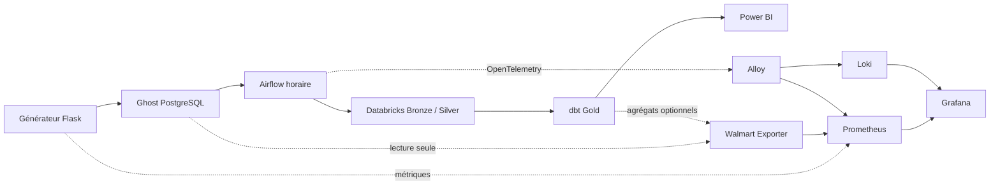

# Guide Grafana et monitoring

## Objectif

La couche de monitoring observe le flux `Générateur → Ghost PostgreSQL → Airflow → Databricks → dbt Gold → Power BI`. Elle est optionnelle : le pipeline principal reste exécutable avec son fichier Compose historique uniquement.



## Démarrage

Depuis la racine `Walmart Streaming Flow` :

```powershell
Copy-Item `
  airflow/monitoring/.env.monitoring.example `
  airflow/monitoring/.env.monitoring

docker compose `
  --env-file airflow/.env `
  --env-file airflow/monitoring/.env.monitoring `
  -f airflow/docker-compose.yaml `
  -f airflow/monitoring/docker-compose.monitoring.yml `
  --profile observability `
  up -d --build
```

Le démarrage historique reste inchangé :

```powershell
docker compose -f airflow/docker-compose.yaml up -d
```

Après la copie du fichier d’exemple, recopiez uniquement la valeur
`POSTGRES_CONNECTION` de `Walmart Data Engineering/.env` vers
`airflow/monitoring/.env.monitoring`. Le `GHOST_API_KEY` n’est ni requis ni
transmis aux conteneurs de monitoring.

## Interfaces

| Service      |      Adresse            | Utilité                  |
|--------------|---------------------    |--------------------------|
| Grafana      | `http://127.0.0.1:3000` | Dashboards techniques    |
| Prometheus   | `http://127.0.0.1:9090` | Métriques et règles      |
| Grafana Alloy| `http://127.0.0.1:12345`| État du collecteur OTEL  |
| Airflow      | `http://127.0.0.1:8080` | Orchestration existante  |

## Dashboards provisionnés

1. **Platform Overview** : disponibilité des services, mémoire des conteneurs et logs Docker.
2. **Airflow Pipeline** : dernier succès, DAG actifs, échecs et durée des tâches.
3. **Generator & Source** : mode, commandes, inscriptions, âge du dernier événement, articles moyens et volumes PostgreSQL.
4. **Data Freshness & Quality** : fraîcheur technique basée sur les insertions/modifications, retard de traitement Source–Gold, dates métier futures, commandes orphelines et `order_item_id` nuls.

## Procédure de travail quotidienne

```powershell
# 1. Démarrer le générateur dans un premier terminal
uv run "Walmart Data Engineering/Walmart dataset/generator_web_app.py"

# 2. Démarrer Airflow et l'observabilité dans un second terminal
docker compose `
  --env-file airflow/.env `
  --env-file airflow/monitoring/.env.monitoring `
  -f airflow/docker-compose.yaml `
  -f airflow/monitoring/docker-compose.monitoring.yml `
  --profile observability `
  up -d

# 3. Vérifier tous les conteneurs
docker compose `
  --env-file airflow/.env `
  --env-file airflow/monitoring/.env.monitoring `
  -f airflow/docker-compose.yaml `
  -f airflow/monitoring/docker-compose.monitoring.yml `
  --profile observability `
  ps
```

## Activer le contrôle Gold

Dans `airflow/monitoring/.env.monitoring` :

```dotenv
WALMART_DATABRICKS_METRICS_ENABLED=true
WALMART_GOLD_TABLE=walmart.gold.fact_orders
```

Puis :

```powershell
docker compose `
  --env-file airflow/.env `
  --env-file airflow/monitoring/.env.monitoring `
  -f airflow/docker-compose.yaml `
  -f airflow/monitoring/docker-compose.monitoring.yml `
  --profile observability `
  up -d walmart-exporter
```

Cette option utilise l’API Databricks Statement Execution avec une requête agrégée en lecture seule. Elle reste désactivée par défaut pour éviter de démarrer le SQL Warehouse uniquement pour le monitoring.

## Règles de sécurité et non-régression

- Grafana et Prometheus sont liés à `127.0.0.1`.
- Les secrets restent dans les fichiers `.env` ignorés par Git.
- Le Walmart Exporter utilise uniquement des `SELECT`.
- Aucune dépendance Airflow ne pointe vers Grafana ou Prometheus.
- Une panne de l’observabilité ne change pas le statut du DAG métier.
- Aucun modèle dbt, test dbt ou schéma Gold n’est modifié.
- Les identifiants `order_id`, `customer_id`, `store_id` et `employee_id` ne deviennent jamais des labels Prometheus.

## Arrêter uniquement le monitoring

```powershell
docker compose `
  --env-file airflow/.env `
  --env-file airflow/monitoring/.env.monitoring `
  -f airflow/docker-compose.yaml `
  -f airflow/monitoring/docker-compose.monitoring.yml `
  stop grafana prometheus alloy loki blackbox-exporter `
       airflow-postgres-exporter cadvisor walmart-exporter
```

Les volumes Prometheus, Loki et Grafana restent conservés.

## Diagnostic rapide

```powershell
# Cibles Prometheus
Start-Process "http://127.0.0.1:9090/targets"

# Santé Grafana
Invoke-RestMethod "http://127.0.0.1:3000/api/health"

# Métriques du générateur
Invoke-WebRequest "http://127.0.0.1:5050/metrics"

# Logs d'un service de monitoring
docker compose `
  --env-file airflow/.env `
  --env-file airflow/monitoring/.env.monitoring `
  -f airflow/docker-compose.yaml `
  -f airflow/monitoring/docker-compose.monitoring.yml `
  logs --tail 100 walmart-exporter
```
