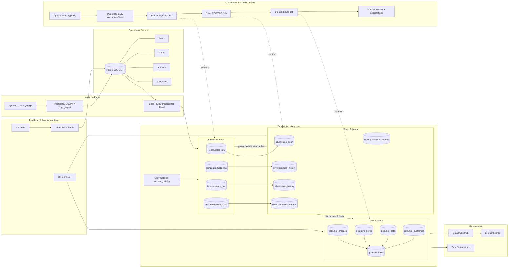
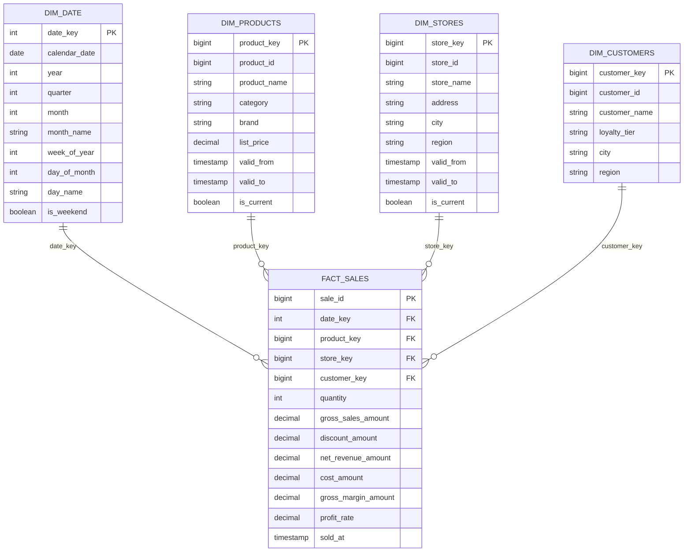

# 🛒 Walmart End-to-End Analytics & Lakehouse Pipeline

<div align="center">

**A production-grade retail data platform built with PostgreSQL, Databricks, Delta Lake, dbt, and Apache Airflow**


---

## 📌 Executive Summary

**Walmart End-to-End Analytics & Lakehouse Pipeline** is an enterprise-style Modern Data Stack implementation that transforms operational retail data into governed, analytics-ready data products. The platform reproduces the core engineering concerns of a Fortune 500 retail environment: high-volume ingestion, distributed processing, incremental state management, dimensional modeling, data quality enforcement, orchestration, observability, and catalog-level governance.

The solution begins with PostgreSQL operational tables for sales, stores, products, and customers. Data is ingested efficiently with Python and PostgreSQL `COPY`, landed as immutable Delta tables in a Bronze layer, standardized and reconciled through CDC and SCD processing in Silver, and exposed as a business-oriented star schema in Gold. dbt provides modular SQL transformation, documentation, lineage, and tests. Apache Airflow acts as the control plane, using the Databricks SDK to launch and monitor remote jobs without embedding compute logic inside the scheduler.

### Business value

| Business requirement       | Engineering capability | Outcome |
|---                         |---|---|
| Trustworthy retail KPIs    | Tested Gold facts and conformed dimensions | Consistent revenue, margin, quantity, and profit-rate reporting |
| Historical reproducibility | Delta Lake ACID transactions, time travel, and SCD Type 2 | Auditable answers for “what was known at that time?” |
| Fast daily refreshes       | Incremental CDC, partition pruning, and idempotent `MERGE` | Lower latency and reduced compute consumption |
| Enterprise governance      | Unity Catalog, schema isolation, lineage metadata, and least privilege | Discoverable, controlled, and traceable datasets |
| Operational resilience     | Airflow retries, remote run monitoring, and deterministic jobs | Recoverable pipelines with clear failure boundaries |
| Developer productivity     | `uv`, dbt, reusable macros, and environment-driven configuration | Reproducible local and CI/CD workflows |
| Agentic data access        | Ghost MCP server connected to PostgreSQL through VS Code | Natural-language exploration without bypassing database controls |

### Design principles

- **Idempotency:** rerunning a pipeline produces the same target state and never duplicates business events.
- **Separation of concerns:** ingestion, storage, transformation, orchestration, and presentation remain independently maintainable.
- **Metadata first:** every dataset carries ingestion timestamps, source provenance, checksums, ownership, and quality expectations.
- **Incremental by default:** CDC watermarks and Delta `MERGE` minimize unnecessary processing.
- **Secure by design:** secrets remain in `.env`, Airflow Connections, or a secret manager and are never committed.
- **Observable by default:** row counts, rejected records, run identifiers, timestamps, and quality outcomes are measurable at each boundary.

> [!NOTE]
> This repository is an educational portfolio implementation inspired by large-scale retail analytics patterns. It is not affiliated with, endorsed by, or operated by Walmart Inc. “Walmart” is used solely as the business-domain scenario.

---

## 🏗️ Platform Architecture



### End-to-end control flow

1. Operational entities are created or changed in PostgreSQL.
2. Python seed and ingestion utilities use `psycopg2`; bulk datasets use `cursor.copy_expert()` and PostgreSQL `COPY` rather than row-by-row inserts.
3. Databricks reads source increments over JDBC and appends immutable observations to Bronze Delta tables.
4. Silver jobs enforce schema, normalize values, quarantine invalid records, deduplicate events, and apply CDC with transactional `MERGE INTO` statements.
5. SCD Type 1 overwrites non-historical attributes; SCD Type 2 closes the active version and inserts a new version for historically significant changes.
6. dbt builds tested Gold dimensions and the `fact_sales` table in `walmart_catalog.gold`.
7. Airflow submits Databricks jobs, waits for terminal success, retries transient failures, and records run metadata.
8. Databricks SQL, BI tools, and data-science workloads consume governed Gold tables.

---

## 🥉🥈🥇 Deep-Dive: Medallion Architecture

### Layer contracts

| Layer | Unity Catalog namespace | Data contract | Write pattern | Primary consumers |
|-------|-------------------------|---------------|---------------|-------------------|
| Bronze | `walmart_catalog.bronze` | Source-faithful, append-only records plus audit metadata | Append | Data engineers, replay jobs |
| Silver | `walmart_catalog.silver` | Typed, deduplicated, reconciled, CDC-aware entities | `MERGE`, overwrite of affected partitions | dbt, analysts, ML features |
| Gold | `walmart_catalog.gold` | Conformed star schema and stable business metrics | dbt incremental/full build | BI, finance, operations, analytics |

### 🥉 Bronze — raw, immutable, replayable

Bronze preserves the source payload at the lowest practical level of transformation. Source names and values are retained, while technical metadata makes every record traceable and deduplicable.

**Required audit columns**

|    Column          |    Type     |                            Purpose                                |
|--------------------|-------------|-------------------------------------------------------------------|
| `_ingested_at`     | `TIMESTAMP` | UTC timestamp when the record entered the lakehouse               |
| `_source_file`     | `STRING`    | JDBC batch identifier, file path, or logical source reference     |
| `_checksum`        | `STRING`    | SHA-256 digest of deterministic business columns                  |
| `_batch_id`        | `STRING`    | Airflow/Databricks run correlation identifier                     |
| `_source_system`   | `STRING`    | Origin system, fixed to `postgresql_walmart_oltp` for this source |

**Bronze rules**

- Operations are append-only; corrections arrive as new versions rather than destructive updates.
- Ingestion timestamps are UTC.
- Schema drift is detected and surfaced before downstream promotion.
- Records are retained long enough to support replay and root-cause analysis.
- Checksums use normalized null handling and stable column ordering.
- No business aggregation or irreversible standardization occurs in Bronze.

```sql
CREATE TABLE IF NOT EXISTS walmart_catalog.bronze.sales_raw (
    sale_id BIGINT,
    store_id BIGINT,
    product_id BIGINT,
    customer_id BIGINT,
    sale_timestamp TIMESTAMP,
    quantity INT,
    unit_price DECIMAL(18, 2),
    unit_cost DECIMAL(18, 2),
    discount_amount DECIMAL(18, 2),
    payment_method STRING,
    source_updated_at TIMESTAMP,
    _ingested_at TIMESTAMP NOT NULL,
    _source_file STRING NOT NULL,
    _checksum STRING NOT NULL,
    _batch_id STRING NOT NULL,
    _source_system STRING NOT NULL
)
USING DELTA
PARTITIONED BY (date_trunc('DAY', sale_timestamp))
TBLPROPERTIES (
    'delta.enableChangeDataFeed' = 'true',
    'delta.autoOptimize.optimizeWrite' = 'true',
    'delta.autoOptimize.autoCompact' = 'true'
);
```

### 🥈 Silver — clean, current, and historically correct

Silver converts raw observations into reliable domain entities. It is the system of record for cleaned transactional data and historical dimensions.

**Processing sequence**

1. Cast source fields to contract types.
2. Standardize case, whitespace, currency precision, timestamps, and null representations.
3. Reject impossible values such as non-positive quantities or negative prices.
4. Deduplicate by business key, retaining the newest `source_updated_at`, `_ingested_at`, and `_batch_id` combination.
5. Compare checksums or tracked attribute hashes against current target records.
6. Apply idempotent CDC upserts.
7. Route invalid records to `silver.quarantine_records` with a reason code and source payload.
8. Publish quality metrics: accepted count, rejected count, duplicate count, and merge counts.

#### Stateful CDC with Delta Lake

```sql
MERGE INTO walmart_catalog.silver.sales_clean AS target
USING (
    SELECT
        sale_id,
        store_id,
        product_id,
        customer_id,
        CAST(sale_timestamp AS TIMESTAMP) AS sale_timestamp,
        CAST(quantity AS INT) AS quantity,
        CAST(unit_price AS DECIMAL(18, 2)) AS unit_price,
        CAST(unit_cost AS DECIMAL(18, 2)) AS unit_cost,
        CAST(discount_amount AS DECIMAL(18, 2)) AS discount_amount,
        UPPER(TRIM(payment_method)) AS payment_method,
        source_updated_at,
        _checksum,
        _ingested_at,
        _batch_id
    FROM (
        SELECT *,
               ROW_NUMBER() OVER (
                   PARTITION BY sale_id
                   ORDER BY source_updated_at DESC, _ingested_at DESC, _batch_id DESC
               ) AS row_rank
        FROM walmart_catalog.bronze.sales_raw
        WHERE quantity > 0
          AND unit_price >= 0
          AND unit_cost >= 0
          AND discount_amount >= 0
    ) ranked
    WHERE row_rank = 1
) AS source
ON target.sale_id = source.sale_id
WHEN MATCHED
 AND source.source_updated_at >= target.source_updated_at
 AND source._checksum <> target._checksum
THEN UPDATE SET
    target.store_id = source.store_id,
    target.product_id = source.product_id,
    target.customer_id = source.customer_id,
    target.sale_timestamp = source.sale_timestamp,
    target.quantity = source.quantity,
    target.unit_price = source.unit_price,
    target.unit_cost = source.unit_cost,
    target.discount_amount = source.discount_amount,
    target.payment_method = source.payment_method,
    target.source_updated_at = source.source_updated_at,
    target._checksum = source._checksum,
    target._updated_at = current_timestamp(),
    target._batch_id = source._batch_id
WHEN NOT MATCHED THEN INSERT (
    sale_id, store_id, product_id, customer_id, sale_timestamp,
    quantity, unit_price, unit_cost, discount_amount, payment_method,
    source_updated_at, _checksum, _created_at, _updated_at, _batch_id
) VALUES (
    source.sale_id, source.store_id, source.product_id, source.customer_id,
    source.sale_timestamp, source.quantity, source.unit_price, source.unit_cost,
    source.discount_amount, source.payment_method, source.source_updated_at,
    source._checksum, current_timestamp(), current_timestamp(), source._batch_id
);
```

#### SCD Type 1 — current-state corrections

SCD Type 1 is used where previous values have no analytical value, such as customer email normalization or spelling corrections. The business key remains stable and changed attributes are overwritten.

```sql
MERGE INTO walmart_catalog.silver.customers_current AS target
USING walmart_catalog.silver.customers_staged AS source
ON target.customer_id = source.customer_id
WHEN MATCHED AND target.attribute_hash <> source.attribute_hash THEN
  UPDATE SET
    target.customer_name = source.customer_name,
    target.email = source.email,
    target.loyalty_tier = source.loyalty_tier,
    target.attribute_hash = source.attribute_hash,
    target.updated_at = current_timestamp()
WHEN NOT MATCHED THEN
  INSERT (
    customer_id, customer_name, email, loyalty_tier,
    attribute_hash, created_at, updated_at
  )
  VALUES (
    source.customer_id, source.customer_name, source.email, source.loyalty_tier,
    source.attribute_hash, current_timestamp(), current_timestamp()
  );
```

#### SCD Type 2 — historically significant attributes

Product prices and store addresses are historized. Each version receives a surrogate key, `valid_from`, `valid_to`, and `is_current`. The open-ended version uses `9999-12-31 23:59:59`.

```sql
MERGE INTO walmart_catalog.silver.products_history AS target
USING walmart_catalog.silver.products_staged AS source
ON target.product_id = source.product_id
AND target.is_current = TRUE
WHEN MATCHED AND target.tracked_hash <> source.tracked_hash THEN
  UPDATE SET
    target.valid_to = source.effective_at - INTERVAL 1 MICROSECOND,
    target.is_current = FALSE,
    target.updated_at = current_timestamp();

INSERT INTO walmart_catalog.silver.products_history (
    product_sk,
    product_id,
    product_name,
    category,
    brand,
    list_price,
    tracked_hash,
    valid_from,
    valid_to,
    is_current,
    created_at,
    updated_at
)
SELECT
    xxhash64(concat_ws('|', CAST(source.product_id AS STRING), CAST(source.effective_at AS STRING))),
    source.product_id,
    source.product_name,
    source.category,
    source.brand,
    source.list_price,
    source.tracked_hash,
    source.effective_at,
    TIMESTAMP '9999-12-31 23:59:59',
    TRUE,
    current_timestamp(),
    current_timestamp()
FROM walmart_catalog.silver.products_staged AS source
LEFT JOIN walmart_catalog.silver.products_history AS current_version
  ON current_version.product_id = source.product_id
 AND current_version.is_current = TRUE
 AND current_version.tracked_hash = source.tracked_hash
WHERE current_version.product_id IS NULL;
```

> The close-and-insert statements execute in the same Databricks workflow task boundary. Production implementations should stage changed keys and use a single atomic Delta pattern or transaction-capable workflow design to prevent partially applied SCD state.

### 🥇 Gold — governed dimensional data products

Gold exposes business semantics rather than source-system semantics. The grain of `fact_sales` is **one completed sales line identified by `sale_id`**. Dimensions use surrogate keys so facts resolve against the dimension version valid at the sale timestamp.

#### Dimensional model



#### Metric definitions

| Metric       | Definition | Formula |
|--------|---|---|
| Gross sales | Value before discounts | `quantity × unit_price` |
| Net revenue | Recognized sales after discounts | `gross_sales_amount − discount_amount` |
| Cost amount | Extended merchandise cost | `quantity × unit_cost` |
| Gross margin | Revenue remaining after merchandise cost | `net_revenue_amount − cost_amount` |
| Profit rate | Gross margin relative to net revenue | `gross_margin_amount / net_revenue_amount` |

Financial measures use fixed-precision `DECIMAL`, not floating-point values. Division uses `NULLIF(net_revenue_amount, 0)` to prevent divide-by-zero errors.

---

## ⚡ Key Technical Highlights

### 🤖 Agentic ingestion with Ghost MCP

Ghost MCP acts as a Model Context Protocol server between VS Code and PostgreSQL. It enables natural-language schema exploration, query generation, and controlled operational interaction while PostgreSQL remains the authoritative system.

**Safety boundary**

- The MCP identity receives `SELECT` on production-like schemas by default.
- Mutation operations use a separately authorized role.
- Generated SQL is reviewed before execution for destructive or broad operations.
- Database statement timeouts and connection limits protect the OLTP workload.
- Credentials are supplied through environment variables or a secret manager.
- MCP-assisted operations are logged with actor, timestamp, SQL fingerprint, and outcome.

The agentic interface augments engineering workflows; it does not replace deterministic pipelines, schema contracts, tests, or code review.

### 🔁 Stateful CDC and SCD Type 1/2

- Source changes are ordered by `source_updated_at` and ingestion metadata.
- Business-key duplicates are resolved deterministically with window functions.
- Delta Lake `MERGE` provides atomic upsert behavior.
- Checksums prevent unchanged records from causing unnecessary rewrites.
- Type 1 models represent the latest corrected state.
- Type 2 models preserve price and store-address history with non-overlapping validity windows.
- Late-arriving facts resolve their dimension key against `sold_at`, not the pipeline execution time.
- Unknown dimension members use a controlled surrogate key such as `-1` rather than breaking fact loads.

### 🧱 dbt modeling, macros, and automated tests

The dbt project uses layered model directories, explicit sources, model contracts, incremental strategies, reusable macros, and schema-level tests. A custom metric macro prevents divergent finance logic across models.

```sql

    cast(
        {{ gross_margin_expression }}
        / nullif({{ revenue_expression }}, 0)
        as decimal(18, 6)
    )

```

```sql
{{
  config(
    materialized='incremental',
    incremental_strategy='merge',
    unique_key='sale_id',
    on_schema_change='fail',
    contract={'enforced': true},
    tags=['gold', 'sales', 'daily']
  )
}}

with sales as (
    select *
    from {{ ref('stg_sales') }}
    
      where source_updated_at >= (
        select coalesce(max(source_updated_at), timestamp '1900-01-01') from {{ this }}
      )
    
),
resolved as (
    select
        s.sale_id,
        d.date_key,
        p.product_key,
        st.store_key,
        coalesce(c.customer_key, -1) as customer_key,
        s.quantity,
        cast(s.quantity * s.unit_price as decimal(18, 2)) as gross_sales_amount,
        s.discount_amount,
        cast((s.quantity * s.unit_price) - s.discount_amount as decimal(18, 2)) as net_revenue_amount,
        cast(s.quantity * s.unit_cost as decimal(18, 2)) as cost_amount,
        s.sale_timestamp as sold_at,
        s.source_updated_at
    from sales s
    join {{ ref('dim_date') }} d
      on d.calendar_date = cast(s.sale_timestamp as date)
    join {{ ref('dim_products') }} p
      on p.product_id = s.product_id
     and s.sale_timestamp between p.valid_from and p.valid_to
    join {{ ref('dim_stores') }} st
      on st.store_id = s.store_id
     and s.sale_timestamp between st.valid_from and st.valid_to
    left join {{ ref('dim_customers') }} c
      on c.customer_id = s.customer_id
)
select
    *,
    cast(net_revenue_amount - cost_amount as decimal(18, 2)) as gross_margin_amount,
    {{ safe_profit_rate('net_revenue_amount - cost_amount', 'net_revenue_amount') }} as profit_rate
from resolved
```

### 🎛️ Headless orchestration through the Databricks SDK

Airflow is the control plane; Databricks is the compute plane. The DAG does not pollute scheduler workers with Spark execution. It invokes existing Databricks jobs by ID, waits for completion, and fails explicitly if the remote run is unsuccessful.

```python
from __future__ import annotations

import os
from datetime import datetime, timedelta, timezone

from airflow.decorators import dag, task
from databricks.sdk import WorkspaceClient
from databricks.sdk.service.jobs import RunLifeCycleState, RunResultState


def run_databricks_job(job_id: int, batch_id: str) -> int:
    workspace = WorkspaceClient(
        host=os.environ["DATABRICKS_HOST"],
        token=os.environ["DATABRICKS_TOKEN"],
    )
    response = workspace.jobs.run_now(
        job_id=job_id,
        job_parameters={"batch_id": batch_id},
    )
    run_id = response.run_id
    if run_id is None:
        raise RuntimeError(f"Databricks job {job_id} returned no run_id")

    completed = workspace.jobs.wait_get_run_job_terminated_or_skipped(
        run_id=run_id,
        timeout=timedelta(hours=2),
    )
    state = completed.state
    if state is None:
        raise RuntimeError(f"Databricks run {run_id} returned no terminal state")
    if state.life_cycle_state not in {
        RunLifeCycleState.TERMINATED,
        RunLifeCycleState.SKIPPED,
    }:
        raise RuntimeError(f"Run {run_id} ended in {state.life_cycle_state}")
    if state.result_state != RunResultState.SUCCESS:
        raise RuntimeError(
            f"Run {run_id} failed: result={state.result_state}, message={state.state_message}"
        )
    return run_id


@dag(
    dag_id="walmart_lakehouse_daily",
    description="Daily Bronze-to-Gold Walmart retail lakehouse pipeline",
    schedule="@daily",
    start_date=datetime(2025, 1, 1, tzinfo=timezone.utc),
    catchup=False,
    max_active_runs=1,
    default_args={
        "owner": "data-platform",
        "retries": 3,
        "retry_delay": timedelta(minutes=5),
        "retry_exponential_backoff": True,
        "max_retry_delay": timedelta(minutes=30),
    },
    tags=["walmart", "databricks", "dbt", "lakehouse"],
)
def walmart_lakehouse_daily():
    @task
    def bronze(**context) -> int:
        batch_id = context["run_id"]
        return run_databricks_job(int(os.environ["DATABRICKS_BRONZE_JOB_ID"]), batch_id)

    @task
    def silver(_: int, **context) -> int:
        batch_id = context["run_id"]
        return run_databricks_job(int(os.environ["DATABRICKS_SILVER_JOB_ID"]), batch_id)

    @task
    def gold_and_tests(_: int, **context) -> int:
        batch_id = context["run_id"]
        return run_databricks_job(int(os.environ["DATABRICKS_DBT_JOB_ID"]), batch_id)

    bronze_run = bronze()
    silver_run = silver(bronze_run)
    gold_and_tests(silver_run)


walmart_lakehouse_daily()
```

> Depending on the installed `databricks-sdk` version, the waiter may also be expressed through `wait_get_successful_job_run`. Pin the SDK in `uv.lock` and use one waiter API consistently across local, CI, and Airflow environments.

---

## 🗂️ Repository Structure

```text
walmart-lakehouse-pipeline/
├── .github/
│   └── workflows/
│       ├── ci.yml
│       └── deploy-databricks.yml
├── config/
│   ├── logging.yaml
│   ├── spark.yaml
│   └── table_contracts.yaml
├── dags/
│   └── walmart_lakehouse_daily.py
├── dbt_project/
│   ├── analyses/
│   │   └── margin_diagnostics.sql
│   ├── macros/
│   │   ├── generate_schema_name.sql
│   │   ├── safe_profit_rate.sql
│   │   └── test_scd2_no_overlap.sql
│   ├── models/
│   │   ├── staging/
│   │   │   ├── sources.yml
│   │   │   ├── stg_customers.sql
│   │   │   ├── stg_products.sql
│   │   │   ├── stg_sales.sql
│   │   │   └── stg_stores.sql
│   │   ├── silver/
│   │   │   ├── int_customers_current.sql
│   │   │   ├── int_products_history.sql
│   │   │   ├── int_sales_clean.sql
│   │   │   └── int_stores_history.sql
│   │   └── gold/
│   │       ├── dim_customers.sql
│   │       ├── dim_date.sql
│   │       ├── dim_products.sql
│   │       ├── dim_stores.sql
│   │       ├── fact_sales.sql
│   │       └── schema.yml
│   ├── seeds/
│   │   └── accepted_payment_methods.csv
│   ├── snapshots/
│   │   ├── products_snapshot.sql
│   │   └── stores_snapshot.sql
│   ├── tests/
│   │   ├── assert_fact_reconciles_to_sales.sql
│   │   ├── assert_non_negative_financials.sql
│   │   └── assert_scd2_single_current_record.sql
│   ├── dbt_project.yml
│   ├── packages.yml
│   └── profiles.yml
├── notebooks/
│   ├── 01_bronze_ingestion.py
│   ├── 02_silver_cdc.py
│   ├── 03_silver_scd.py
│   └── 04_optimize_and_vacuum.py
├── scripts/
│   ├── create_unity_catalog.sql
│   ├── seed_database.py
│   ├── validate_environment.py
│   └── wait_for_postgres.py
├── sql/
│   ├── analytics/
│   │   ├── customer_segments.sql
│   │   ├── margin_trends.sql
│   │   └── store_performance.sql
│   └── ddl/
│       └── postgresql_schema.sql
├── tests/
│   ├── integration/
│   │   └── test_postgres_seed.py
│   └── unit/
│       ├── test_checksums.py
│       └── test_config.py
├── .env.example
├── .gitignore
├── .python-version
├── docker-compose.yml
├── LICENSE
├── pyproject.toml
├── README.md
└── uv.lock
```

### Directory responsibilities

- `dags/`: Airflow orchestration only; no Spark transformation logic.
- `dbt_project/`: SQL models, source declarations, contracts, macros, tests, snapshots, and documentation.
- `notebooks/`: Databricks entry points for ingestion, CDC/SCD processing, and table maintenance.
- `scripts/`: deterministic setup, seeding, validation, and administrative utilities.
- `config/`: non-secret runtime configuration and data contracts.
- `sql/analytics/`: version-controlled business queries for analysts and BI validation.
- `tests/`: Python unit and integration tests outside the dbt test suite.

---

## 🚀 Quickstart & Deployment Guide

### 1. Prerequisites

| Component | Minimum | Purpose |
|---|---:|---|
| Python | 3.12 | Ingestion, orchestration, utilities |
| `uv` | Current stable | Reproducible dependency and virtual-environment management |
| PostgreSQL | 15+ | OLTP source system |
| Databricks workspace | Unity Catalog enabled | Spark compute, Delta Lake, governed storage |
| dbt Core | 1.8+ | SQL transformation and testing |
| `dbt-databricks` | Compatible with pinned dbt Core | Databricks adapter |
| Apache Airflow | 2.8+ | Scheduling and orchestration |
| Databricks SQL Warehouse | Running or serverless | dbt execution endpoint |
| Git | 2.40+ | Version control |

The Databricks identity must be able to use the SQL warehouse or cluster, run the configured jobs, and create/use objects in `walmart_catalog` according to the deployment model.

### 2. Clone and install with `uv`

```bash
git clone https://github.com/amineaitali/walmart-lakehouse-pipeline.git
cd walmart-lakehouse-pipeline
uv sync --frozen
uv run python --version
uv run dbt --version
```

A representative dependency declaration is:

```toml
[project]
name = "walmart-lakehouse-pipeline"
version = "1.0.0"
description = "End-to-end retail analytics lakehouse pipeline"
requires-python = ">=3.12,<3.13"
dependencies = [
  "apache-airflow>=2.8,<3.0",
  "astronomer-cosmos>=1.5,<2.0",
  "databricks-sdk>=0.28,<1.0",
  "dbt-core>=1.8,<2.0",
  "dbt-databricks>=1.8,<2.0",
  "psycopg2-binary>=2.9,<3.0",
  "python-dotenv>=1.0,<2.0",
  "pyyaml>=6.0,<7.0",
]

[dependency-groups]
dev = [
  "pytest>=8.0,<9.0",
  "pytest-cov>=5.0,<7.0",
  "ruff>=0.5,<1.0",
]
```

### 3. Configure secrets without committing them

Create `.env` interactively so credentials do not appear in shell history or repository files:

```bash
set -e
read -r -p "PostgreSQL host [localhost]: " POSTGRES_HOST
POSTGRES_HOST="${POSTGRES_HOST:-localhost}"
read -r -p "PostgreSQL port [5432]: " POSTGRES_PORT
POSTGRES_PORT="${POSTGRES_PORT:-5432}"
read -r -p "PostgreSQL database [walmart_oltp]: " POSTGRES_DB
POSTGRES_DB="${POSTGRES_DB:-walmart_oltp}"
read -r -p "PostgreSQL user [walmart_app]: " POSTGRES_USER
POSTGRES_USER="${POSTGRES_USER:-walmart_app}"
read -r -s -p "PostgreSQL password: " POSTGRES_PASSWORD
printf '\n'
read -r -p "Databricks workspace URL: " DATABRICKS_HOST
read -r -s -p "Databricks personal access token: " DATABRICKS_TOKEN
printf '\n'
read -r -p "Databricks SQL HTTP path: " DATABRICKS_HTTP_PATH
read -r -p "Bronze job ID: " DATABRICKS_BRONZE_JOB_ID
read -r -p "Silver job ID: " DATABRICKS_SILVER_JOB_ID
read -r -p "dbt job ID: " DATABRICKS_DBT_JOB_ID

umask 077
cat > .env <<EOF
POSTGRES_HOST=${POSTGRES_HOST}
POSTGRES_PORT=${POSTGRES_PORT}
POSTGRES_DB=${POSTGRES_DB}
POSTGRES_USER=${POSTGRES_USER}
POSTGRES_PASSWORD=${POSTGRES_PASSWORD}
DATABRICKS_HOST=${DATABRICKS_HOST}
DATABRICKS_TOKEN=${DATABRICKS_TOKEN}
DATABRICKS_HTTP_PATH=${DATABRICKS_HTTP_PATH}
DATABRICKS_CATALOG=walmart_catalog
DATABRICKS_BRONZE_JOB_ID=${DATABRICKS_BRONZE_JOB_ID}
DATABRICKS_SILVER_JOB_ID=${DATABRICKS_SILVER_JOB_ID}
DATABRICKS_DBT_JOB_ID=${DATABRICKS_DBT_JOB_ID}
AIRFLOW_HOME=$(pwd)/.airflow
AIRFLOW__CORE__EXECUTOR=LocalExecutor
AIRFLOW__CORE__LOAD_EXAMPLES=False
EOF
```

Load and validate the configuration:

```bash
set -a
. ./.env
set +a
uv run python scripts/validate_environment.py
```

Required `.gitignore` entries:

```gitignore
.env
.venv/
.airflow/
target/
logs/
dbt_packages/
__pycache__/
.pytest_cache/
.coverage
```

### 4. Prepare PostgreSQL and seed source data

Create the local database and role using an administrative PostgreSQL account:

```bash
psql -v ON_ERROR_STOP=1 --dbname postgres <<'SQL'
DO $block$
BEGIN
    IF NOT EXISTS (SELECT 1 FROM pg_roles WHERE rolname = 'walmart_app') THEN
        CREATE ROLE walmart_app LOGIN PASSWORD 'local_development_only_change_me';
    END IF;
END
$block$;

SELECT 'CREATE DATABASE walmart_oltp OWNER walmart_app'
WHERE NOT EXISTS (SELECT 1 FROM pg_database WHERE datname = 'walmart_oltp')\gexec
SQL
```

Ensure `.env` contains the same local password, then create source tables and seed deterministic retail data:

```bash
set -a
. ./.env
set +a
psql "host=${POSTGRES_HOST} port=${POSTGRES_PORT} dbname=${POSTGRES_DB} user=${POSTGRES_USER} password=${POSTGRES_PASSWORD}" \
  -v ON_ERROR_STOP=1 \
  -f sql/ddl/postgresql_schema.sql
uv run python scripts/seed_database.py --stores 100 --products 10000 --customers 50000 --sales 1000000 --truncate-first
```

The seed utility should use `COPY` through `cursor.copy_expert()` for large tables, commit once per bounded batch, generate deterministic data from a fixed seed, and print inserted row counts and elapsed time.

### 5. Create Unity Catalog namespaces

Run as a Databricks principal with catalog creation privileges:

```sql
CREATE CATALOG IF NOT EXISTS walmart_catalog
COMMENT 'Governed retail lakehouse catalog for the Walmart analytics project';

CREATE SCHEMA IF NOT EXISTS walmart_catalog.bronze
COMMENT 'Immutable source-aligned Delta tables';

CREATE SCHEMA IF NOT EXISTS walmart_catalog.silver
COMMENT 'Validated CDC and historical domain entities';

CREATE SCHEMA IF NOT EXISTS walmart_catalog.gold
COMMENT 'Conformed dimensional marts and business metrics';

GRANT USE CATALOG ON CATALOG walmart_catalog TO `data_engineers`;
GRANT USE SCHEMA, CREATE TABLE, MODIFY, SELECT
ON SCHEMA walmart_catalog.bronze TO `data_engineers`;
GRANT USE SCHEMA, CREATE TABLE, MODIFY, SELECT
ON SCHEMA walmart_catalog.silver TO `data_engineers`;
GRANT USE SCHEMA, CREATE TABLE, MODIFY, SELECT
ON SCHEMA walmart_catalog.gold TO `analytics_engineers`;
GRANT USE CATALOG ON CATALOG walmart_catalog TO `retail_analysts`;
GRANT USE SCHEMA, SELECT ON SCHEMA walmart_catalog.gold TO `retail_analysts`;
```

### 6. Configure and run dbt

`dbt_project/profiles.yml` reads credentials exclusively from environment variables:

```yaml
walmart_lakehouse:
  target: dev
  outputs:
    dev:
      type: databricks
      catalog: "{{ env_var('DATABRICKS_CATALOG', 'walmart_catalog') }}"
      schema: gold
      host: "{{ env_var('DATABRICKS_HOST') }}"
      http_path: "{{ env_var('DATABRICKS_HTTP_PATH') }}"
      token: "{{ env_var('DATABRICKS_TOKEN') }}"
      threads: 4
      connect_retries: 3
      connect_timeout: 30
```

Install packages, validate connectivity, build, and test:

```bash
set -a
. ./.env
set +a
cd dbt_project
uv run dbt deps
uv run dbt debug --profiles-dir .
uv run dbt seed --profiles-dir . --full-refresh
uv run dbt run --profiles-dir . --select tag:gold
uv run dbt test --profiles-dir . --select tag:gold
uv run dbt docs generate --profiles-dir .
cd ..
```

For a single atomic selection that runs models, tests, seeds, and snapshots in dependency order:

```bash
cd dbt_project
uv run dbt build --profiles-dir . --select +fact_sales
cd ..
```

### 7. Initialize and launch Airflow

```bash
set -a
. ./.env
set +a
mkdir -p "${AIRFLOW_HOME}"
uv run airflow db migrate
uv run airflow users create \
  --username admin \
  --firstname Data \
  --lastname Platform \
  --role Admin \
  --email admin@localhost \
  --password local_admin_change_me
```

Start Airflow components in separate terminals:

```bash
set -a
. ./.env
set +a
uv run airflow webserver --port 8080
```

```bash
set -a
. ./.env
set +a
uv run airflow scheduler
```

Validate and trigger the DAG:

```bash
set -a
. ./.env
set +a
uv run airflow dags list | grep walmart_lakehouse_daily
uv run airflow dags test walmart_lakehouse_daily 2026-01-15
uv run airflow dags unpause walmart_lakehouse_daily
uv run airflow dags trigger walmart_lakehouse_daily
```

Open `http://localhost:8080`, inspect the task graph, and confirm that Bronze, Silver, Gold, and quality tasks complete successfully.

### 8. Production deployment checklist

- Replace personal access tokens with workload identity or service-principal authentication.
- Store secrets in Databricks Secret Scopes, Airflow Connections, or an enterprise secret manager.
- Use remote Airflow metadata storage; do not use SQLite with `LocalExecutor`.
- Pin and review `uv.lock` in source control.
- Deploy Databricks jobs and permissions through infrastructure as code.
- Separate `dev`, `staging`, and `prod` catalogs or schemas.
- Add CI gates for `ruff`, `pytest`, `dbt parse`, `dbt compile`, and changed-model tests.
- Configure cluster policies, autoscaling bounds, budgets, and tags.
- Set job-level timeouts and Airflow execution timeouts.
- Enable structured logging, alerting, and run links from Airflow to Databricks.
- Define retention policy before running `VACUUM`; never reduce retention without impact review.
- Schedule `OPTIMIZE` selectively based on table size, file statistics, and query patterns.

---

## 🛡️ Data Governance & Quality Suite

### Governance model

Unity Catalog provides three-level names, centralized permissions, discoverability, and lineage. The project uses `walmart_catalog.<layer>.<object>` consistently and assigns privileges to groups rather than individuals.

| Control | Implementation |
|---|---|
| Ownership | Every table includes an owner, description, domain, and support contact in metadata |
| Access | Least-privilege grants at catalog/schema/table level |
| Sensitive data | Customer identifiers classified; direct identifiers restricted or masked |
| Lineage | dbt references plus Unity Catalog lineage from Bronze to Gold |
| Retention | Layer-specific lifecycle rules; Bronze supports replay, Gold supports business audit |
| Auditability | Batch IDs, checksums, source references, timestamps, and Airflow/Databricks run IDs |
| Change management | Pull requests, dbt contracts, migration review, and backward-compatible releases |

### dbt schema tests

```yaml
version: 2

models:
  - name: fact_sales
    description: "One row per completed retail sales line."
    config:
      contract:
        enforced: true
    columns:
      - name: sale_id
        description: "Natural identifier of the sales line."
        data_type: bigint
        constraints:
          - type: not_null
        tests:
          - unique
          - not_null

      - name: date_key
        description: "Calendar dimension foreign key in YYYYMMDD form."
        data_type: int
        tests:
          - not_null
          - relationships:
              to: ref('dim_date')
              field: date_key

      - name: product_key
        description: "Version-aware product surrogate key."
        data_type: bigint
        tests:
          - not_null
          - relationships:
              to: ref('dim_products')
              field: product_key

      - name: store_key
        description: "Version-aware store surrogate key."
        data_type: bigint
        tests:
          - not_null
          - relationships:
              to: ref('dim_stores')
              field: store_key

      - name: payment_method
        description: "Normalized tender type."
        data_type: string
        tests:
          - accepted_values:
              values: ['CASH', 'CREDIT_CARD', 'DEBIT_CARD', 'DIGITAL_WALLET', 'GIFT_CARD']

      - name: quantity
        description: "Number of units sold."
        data_type: int
        tests:
          - not_null

      - name: net_revenue_amount
        description: "Gross sales less discounts."
        data_type: decimal(18,2)
        tests:
          - not_null

      - name: profit_rate
        description: "Gross margin divided by net revenue."
        data_type: decimal(18,6)
```

### Singular reconciliation test

This test returns rows only when the Gold metric differs from its Silver source by more than one cent; therefore, a passing result is empty.

```sql
with silver_total as (
    select
        cast(sum((quantity * unit_price) - discount_amount) as decimal(38, 2)) as amount
    from {{ ref('stg_sales') }}
),
gold_total as (
    select
        cast(sum(net_revenue_amount) as decimal(38, 2)) as amount
    from {{ ref('fact_sales') }}
)
select
    silver_total.amount as silver_amount,
    gold_total.amount as gold_amount,
    abs(silver_total.amount - gold_total.amount) as difference
from silver_total
cross join gold_total
where abs(silver_total.amount - gold_total.amount) > 0.01
```

### SCD Type 2 invariants

The quality suite asserts that:

1. each natural key has exactly one current record;
2. `valid_from < valid_to` for every version;
3. validity windows for the same natural key never overlap;
4. current records end at the approved high date;
5. tracked attribute hashes change between adjacent versions;
6. facts resolve to one and only one dimension version at the event timestamp.

```sql
with ordered_versions as (
    select
        product_id,
        product_key,
        valid_from,
        valid_to,
        lead(valid_from) over (
            partition by product_id order by valid_from
        ) as next_valid_from
    from {{ ref('dim_products') }}
)
select
    product_id,
    product_key,
    valid_from,
    valid_to,
    next_valid_from
from ordered_versions
where next_valid_from is not null
  and valid_to >= next_valid_from
```

### Delta expectations

Expectations are evaluated before Silver promotion. Invalid records are quarantined with reason codes rather than silently discarded.

```python
from pyspark.sql import DataFrame, functions as F


def enforce_sales_expectations(dataframe: DataFrame) -> tuple[DataFrame, DataFrame]:
    evaluated = (
        dataframe
        .withColumn("_valid_sale_id", F.col("sale_id").isNotNull())
        .withColumn("_valid_quantity", F.col("quantity") > F.lit(0))
        .withColumn("_valid_unit_price", F.col("unit_price") >= F.lit(0))
        .withColumn("_valid_unit_cost", F.col("unit_cost") >= F.lit(0))
        .withColumn(
            "_valid_payment_method",
            F.col("payment_method").isin(
                "CASH", "CREDIT_CARD", "DEBIT_CARD", "DIGITAL_WALLET", "GIFT_CARD"
            ),
        )
        .withColumn(
            "_is_valid",
            F.col("_valid_sale_id")
            & F.col("_valid_quantity")
            & F.col("_valid_unit_price")
            & F.col("_valid_unit_cost")
            & F.col("_valid_payment_method"),
        )
        .withColumn(
            "_rejection_reason",
            F.concat_ws(
                ";",
                F.when(~F.col("_valid_sale_id"), F.lit("NULL_SALE_ID")),
                F.when(~F.col("_valid_quantity"), F.lit("INVALID_QUANTITY")),
                F.when(~F.col("_valid_unit_price"), F.lit("INVALID_UNIT_PRICE")),
                F.when(~F.col("_valid_unit_cost"), F.lit("INVALID_UNIT_COST")),
                F.when(~F.col("_valid_payment_method"), F.lit("INVALID_PAYMENT_METHOD")),
            ),
        )
    )
    technical_columns = [
        "_valid_sale_id",
        "_valid_quantity",
        "_valid_unit_price",
        "_valid_unit_cost",
        "_valid_payment_method",
        "_is_valid",
    ]
    accepted = evaluated.filter(F.col("_is_valid")).drop(*technical_columns, "_rejection_reason")
    rejected = evaluated.filter(~F.col("_is_valid")).drop(*technical_columns)
    return accepted, rejected
```

### Quality gates and severity

| Gate | Threshold | Severity | Action |
|---|---:|---|---|
| Primary-key nulls | `0` | Error | Stop publication |
| Duplicate `sale_id` in Gold | `0` | Error | Stop publication |
| Orphan fact foreign keys | `0` excluding approved unknown member | Error | Stop publication |
| Negative financial values | `0` | Error | Quarantine and investigate |
| Source-to-Gold revenue variance | `≤ 0.01` currency unit | Error | Stop publication |
| Quarantine rate | `< 0.5%` daily | Warning/Error by policy | Alert and trend |
| Data freshness | `< 26 hours` | Error | Alert on-call owner |
| SCD overlapping windows | `0` | Error | Stop publication |

---

## 📊 SQL Analytics & Business Intelligence Queries

All queries target `walmart_catalog.gold` and are ready for Databricks SQL.

### 1. Top stores by gross margin

```sql
WITH store_performance AS (
    SELECT
        s.store_key,
        s.store_id,
        s.store_name,
        s.city,
        s.region,
        SUM(f.net_revenue_amount) AS net_revenue,
        SUM(f.gross_margin_amount) AS gross_margin,
        SUM(f.quantity) AS units_sold,
        SUM(f.gross_margin_amount) / NULLIF(SUM(f.net_revenue_amount), 0) AS margin_rate
    FROM walmart_catalog.gold.fact_sales AS f
    JOIN walmart_catalog.gold.dim_stores AS s
      ON s.store_key = f.store_key
    JOIN walmart_catalog.gold.dim_date AS d
      ON d.date_key = f.date_key
    WHERE d.calendar_date >= add_months(current_date(), -12)
    GROUP BY
        s.store_key,
        s.store_id,
        s.store_name,
        s.city,
        s.region
)
SELECT
    store_id,
    store_name,
    city,
    region,
    ROUND(net_revenue, 2) AS net_revenue,
    ROUND(gross_margin, 2) AS gross_margin,
    units_sold,
    ROUND(100 * margin_rate, 2) AS margin_rate_pct,
    DENSE_RANK() OVER (ORDER BY gross_margin DESC) AS gross_margin_rank
FROM store_performance
QUALIFY gross_margin_rank <= 20
ORDER BY gross_margin_rank, store_id;
```

### 2. Monthly revenue trend with year-over-year growth

```sql
WITH monthly AS (
    SELECT
        d.year,
        d.month,
        MIN(d.calendar_date) AS month_start,
        SUM(f.net_revenue_amount) AS net_revenue,
        SUM(f.gross_margin_amount) AS gross_margin,
        SUM(f.quantity) AS units_sold
    FROM walmart_catalog.gold.fact_sales AS f
    JOIN walmart_catalog.gold.dim_date AS d
      ON d.date_key = f.date_key
    GROUP BY d.year, d.month
),
with_prior_year AS (
    SELECT
        *,
        LAG(net_revenue, 12) OVER (ORDER BY month_start) AS prior_year_revenue,
        AVG(net_revenue) OVER (
            ORDER BY month_start
            ROWS BETWEEN 2 PRECEDING AND CURRENT ROW
        ) AS revenue_3m_moving_avg
    FROM monthly
)
SELECT
    month_start,
    ROUND(net_revenue, 2) AS net_revenue,
    ROUND(gross_margin, 2) AS gross_margin,
    units_sold,
    ROUND(revenue_3m_moving_avg, 2) AS revenue_3m_moving_avg,
    ROUND(
        100 * (net_revenue - prior_year_revenue) / NULLIF(prior_year_revenue, 0),
        2
    ) AS revenue_yoy_growth_pct
FROM with_prior_year
ORDER BY month_start;
```

### 3. Category contribution and Pareto analysis

```sql
WITH category_sales AS (
    SELECT
        p.category,
        SUM(f.net_revenue_amount) AS net_revenue,
        SUM(f.gross_margin_amount) AS gross_margin
    FROM walmart_catalog.gold.fact_sales AS f
    JOIN walmart_catalog.gold.dim_products AS p
      ON p.product_key = f.product_key
    GROUP BY p.category
),
ranked AS (
    SELECT
        *,
        SUM(net_revenue) OVER () AS total_revenue,
        SUM(net_revenue) OVER (
            ORDER BY net_revenue DESC
            ROWS BETWEEN UNBOUNDED PRECEDING AND CURRENT ROW
        ) AS cumulative_revenue
    FROM category_sales
)
SELECT
    category,
    ROUND(net_revenue, 2) AS net_revenue,
    ROUND(gross_margin, 2) AS gross_margin,
    ROUND(100 * net_revenue / NULLIF(total_revenue, 0), 2) AS revenue_share_pct,
    ROUND(100 * cumulative_revenue / NULLIF(total_revenue, 0), 2) AS cumulative_share_pct,
    CASE
        WHEN cumulative_revenue / NULLIF(total_revenue, 0) <= 0.80 THEN 'CORE_80_PERCENT'
        ELSE 'LONG_TAIL'
    END AS portfolio_segment
FROM ranked
ORDER BY net_revenue DESC;
```

### 4. Customer RFM segmentation

```sql
WITH customer_metrics AS (
    SELECT
        c.customer_id,
        c.customer_name,
        c.loyalty_tier,
        DATEDIFF(current_date(), MAX(CAST(f.sold_at AS DATE))) AS recency_days,
        COUNT(DISTINCT f.sale_id) AS frequency,
        SUM(f.net_revenue_amount) AS monetary_value
    FROM walmart_catalog.gold.fact_sales AS f
    JOIN walmart_catalog.gold.dim_customers AS c
      ON c.customer_key = f.customer_key
    WHERE c.customer_key <> -1
    GROUP BY c.customer_id, c.customer_name, c.loyalty_tier
),
scored AS (
    SELECT
        *,
        6 - NTILE(5) OVER (ORDER BY recency_days ASC) AS recency_score,
        NTILE(5) OVER (ORDER BY frequency ASC) AS frequency_score,
        NTILE(5) OVER (ORDER BY monetary_value ASC) AS monetary_score
    FROM customer_metrics
)
SELECT
    customer_id,
    customer_name,
    loyalty_tier,
    recency_days,
    frequency,
    ROUND(monetary_value, 2) AS monetary_value,
    CONCAT(recency_score, frequency_score, monetary_score) AS rfm_code,
    CASE
        WHEN recency_score >= 4 AND frequency_score >= 4 AND monetary_score >= 4 THEN 'CHAMPIONS'
        WHEN recency_score >= 3 AND frequency_score >= 3 THEN 'LOYAL'
        WHEN recency_score >= 4 AND frequency_score <= 2 THEN 'PROMISING'
        WHEN recency_score <= 2 AND frequency_score >= 3 THEN 'AT_RISK'
        ELSE 'DEVELOPING'
    END AS customer_segment
FROM scored
ORDER BY monetary_value DESC;
```

### 5. Store performance anomaly detection

```sql
WITH daily_store AS (
    SELECT
        f.store_key,
        d.calendar_date,
        SUM(f.net_revenue_amount) AS daily_revenue
    FROM walmart_catalog.gold.fact_sales AS f
    JOIN walmart_catalog.gold.dim_date AS d
      ON d.date_key = f.date_key
    WHERE d.calendar_date >= date_sub(current_date(), 120)
    GROUP BY f.store_key, d.calendar_date
),
baseline AS (
    SELECT
        *,
        AVG(daily_revenue) OVER (
            PARTITION BY store_key
            ORDER BY calendar_date
            ROWS BETWEEN 28 PRECEDING AND 1 PRECEDING
        ) AS trailing_avg,
        STDDEV_SAMP(daily_revenue) OVER (
            PARTITION BY store_key
            ORDER BY calendar_date
            ROWS BETWEEN 28 PRECEDING AND 1 PRECEDING
        ) AS trailing_stddev
    FROM daily_store
)
SELECT
    s.store_id,
    s.store_name,
    b.calendar_date,
    ROUND(b.daily_revenue, 2) AS daily_revenue,
    ROUND(b.trailing_avg, 2) AS trailing_28d_avg,
    ROUND((b.daily_revenue - b.trailing_avg) / NULLIF(b.trailing_stddev, 0), 2) AS z_score,
    CASE
        WHEN b.daily_revenue < b.trailing_avg - (3 * b.trailing_stddev) THEN 'NEGATIVE_ANOMALY'
        WHEN b.daily_revenue > b.trailing_avg + (3 * b.trailing_stddev) THEN 'POSITIVE_ANOMALY'
        ELSE 'NORMAL'
    END AS anomaly_status
FROM baseline AS b
JOIN walmart_catalog.gold.dim_stores AS s
  ON s.store_key = b.store_key
WHERE b.trailing_stddev IS NOT NULL
  AND ABS((b.daily_revenue - b.trailing_avg) / NULLIF(b.trailing_stddev, 0)) >= 3
ORDER BY b.calendar_date DESC, ABS(z_score) DESC;
```

### 6. Historical product-price impact

```sql
WITH product_periods AS (
    SELECT
        p.product_id,
        p.product_name,
        p.category,
        p.list_price,
        p.valid_from,
        p.valid_to,
        SUM(f.quantity) AS units_sold,
        SUM(f.net_revenue_amount) AS net_revenue,
        SUM(f.gross_margin_amount) AS gross_margin
    FROM walmart_catalog.gold.fact_sales AS f
    JOIN walmart_catalog.gold.dim_products AS p
      ON p.product_key = f.product_key
    GROUP BY
        p.product_id,
        p.product_name,
        p.category,
        p.list_price,
        p.valid_from,
        p.valid_to
),
with_previous AS (
    SELECT
        *,
        LAG(list_price) OVER (
            PARTITION BY product_id ORDER BY valid_from
        ) AS previous_list_price,
        LAG(units_sold) OVER (
            PARTITION BY product_id ORDER BY valid_from
        ) AS previous_units_sold
    FROM product_periods
)
SELECT
    product_id,
    product_name,
    category,
    valid_from,
    valid_to,
    list_price,
    previous_list_price,
    ROUND(100 * (list_price - previous_list_price) / NULLIF(previous_list_price, 0), 2) AS price_change_pct,
    units_sold,
    previous_units_sold,
    ROUND(100 * (units_sold - previous_units_sold) / NULLIF(previous_units_sold, 0), 2) AS unit_change_pct,
    ROUND(net_revenue, 2) AS net_revenue,
    ROUND(gross_margin, 2) AS gross_margin
FROM with_previous
WHERE previous_list_price IS NOT NULL
ORDER BY ABS(price_change_pct) DESC, product_id;
```

---

## 🔧 Operations, Performance & Observability

### Performance practices

- Partition high-volume fact data by a low-cardinality date expression only when it improves pruning.
- Avoid over-partitioning small dimensions.
- Use liquid clustering or the `OPTIMIZE` command with `ZORDER BY` according to workspace capabilities and measured access patterns.
- Compact small files after bursty ingestion, but do not optimize every table after every run.
- Enable adaptive query execution and rely on broadcast joins only for genuinely small dimensions.
- Collect table statistics where they improve the optimizer.
- Bound incremental lookback windows to capture late events while keeping scans efficient.

```sql
OPTIMIZE walmart_catalog.gold.fact_sales
ZORDER BY (date_key, store_key, product_key);

ANALYZE TABLE walmart_catalog.gold.fact_sales
COMPUTE STATISTICS FOR ALL COLUMNS;
```

### Operational telemetry

Each run should emit:

- Airflow DAG run ID and task try number;
- Databricks job and run IDs;
- source watermark range;
- input, inserted, updated, unchanged, rejected, and output row counts;
- data-quality test totals and failures;
- execution duration and compute metadata;
- final table version and latest event timestamp;
- error class, sanitized message, and recovery action.

### Recovery semantics

| Failure point | Recovery behavior |
|---|---|
| PostgreSQL read | Retry from unchanged watermark; do not advance state |
| Bronze append | Reuse batch ID and checksum to prevent duplicate promotion |
| Silver `MERGE` | Rerun the idempotent merge from Bronze |
| SCD update | Rebuild affected natural keys from staged history |
| dbt model | Rerun failed model plus downstream dependents |
| dbt test | Keep previous certified Gold state available; block promotion marker |
| Airflow worker restart | Remote Databricks run remains authoritative and discoverable by run ID |

---

## 🔐 Security Considerations

- Never commit `.env`, tokens, passwords, JDBC URLs containing credentials, or generated Airflow configuration.
- Prefer OAuth machine-to-machine credentials or managed identities over long-lived personal tokens.
- Rotate credentials and restrict token lifetime.
- Encrypt data in transit and at rest.
- Use separate identities for ingestion, transformation, orchestration, and read-only analytics.
- Mask or tokenize customer PII before broad analytical access.
- Avoid logging source rows, tokens, or direct identifiers.
- Review MCP tool permissions and deny destructive SQL for read-only agent workflows.
- Apply row filters or column masks where regional or role-specific access requires them.

---

## ✅ Definition of Done

A daily pipeline release is considered successful when:

- Bronze has ingested the expected source increment with complete audit metadata.
- Silver has no unresolved primary-key duplicates and quarantine remains within policy.
- CDC merges are idempotent and SCD validity windows do not overlap.
- Gold models compile and build successfully.
- All blocking dbt and Delta expectations pass.
- Source-to-Gold financial reconciliation is within one cent.
- Freshness is below 26 hours.
- Airflow records successful terminal Databricks runs for all stages.
- The certified Gold dataset is queryable by authorized analyst groups.

---

## 👤 Author

### Amine Ait Ali

**Data Engineering Student · Modern Data Stack & Lakehouse Architecture**

This project demonstrates hands-on architecture and implementation across operational databases, distributed data processing, transactional lakehouse storage, dimensional modeling, automated quality controls, governance, and production-style orchestration.

**Portfolio focus:** Data Engineering · Databricks · Apache Spark · Delta Lake · dbt · Apache Airflow · PostgreSQL · Python

---

## 📚 References

- [Databricks documentation](https://docs.databricks.com/)
- [Delta Lake documentation](https://docs.delta.io/)
- [Apache Spark documentation](https://spark.apache.org/docs/latest/)
- [dbt documentation](https://docs.getdbt.com/)
- [Apache Airflow documentation](https://airflow.apache.org/docs/)
- [Databricks SDK for Python](https://databricks-sdk-py.readthedocs.io/)
- [PostgreSQL `COPY` documentation](https://www.postgresql.org/docs/current/sql-copy.html)
- [Astral `uv` documentation](https://docs.astral.sh/uv/)
- [Model Context Protocol](https://modelcontextprotocol.io/)
- [Kimball dimensional modeling techniques](https://www.kimballgroup.com/data-warehouse-business-intelligence-resources/kimball-techniques/)

---

<div align="center">

**Built as a production-minded reference architecture for governed, scalable retail analytics.**

⭐ If this project helps you, consider starring the repository.

</div>
