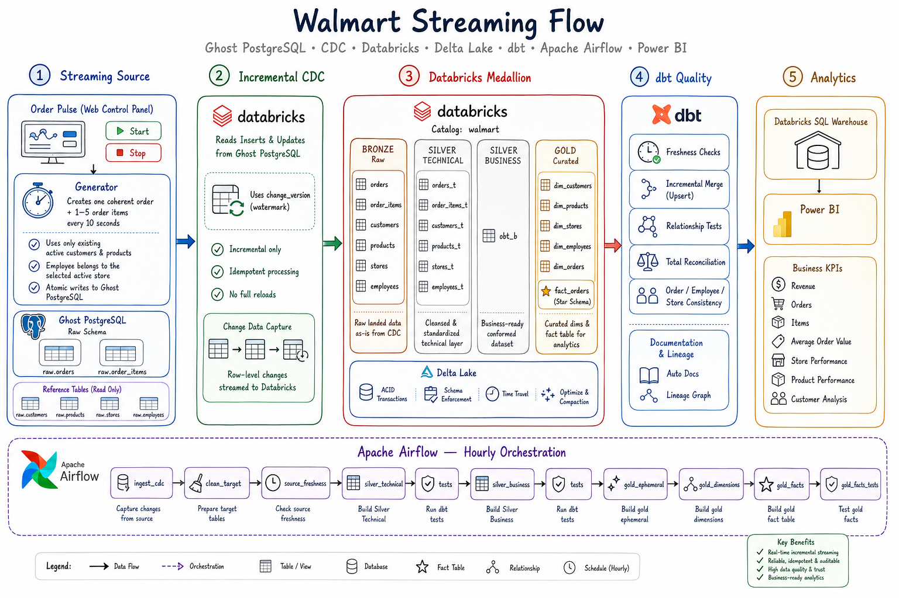
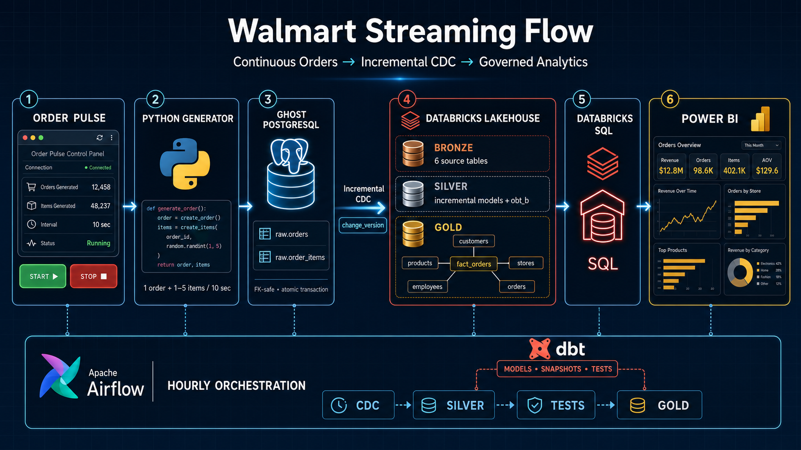
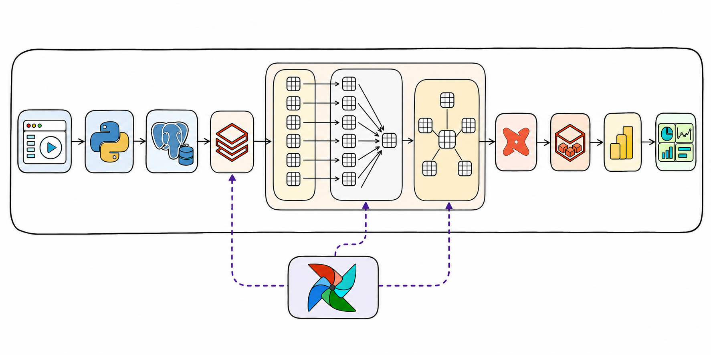
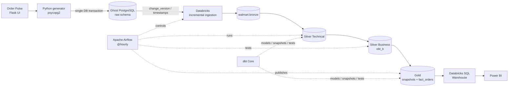
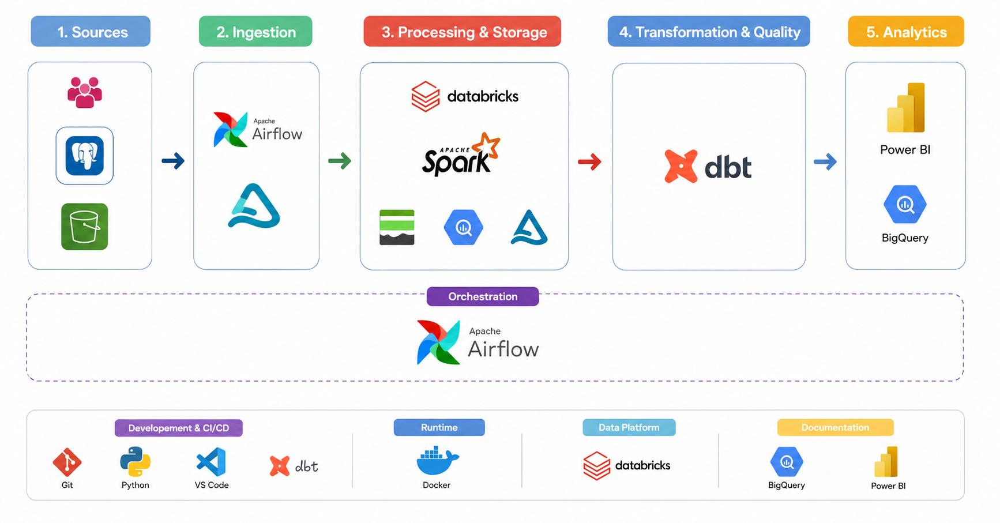
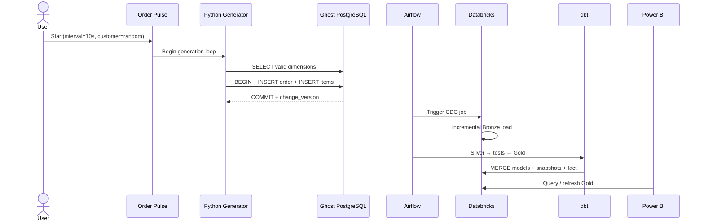
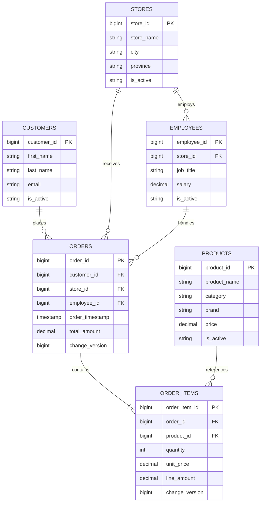
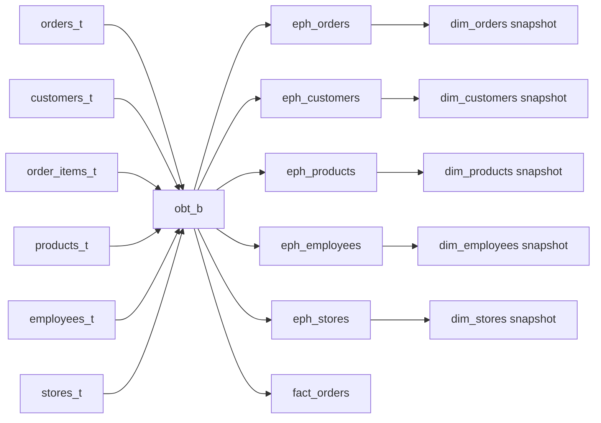
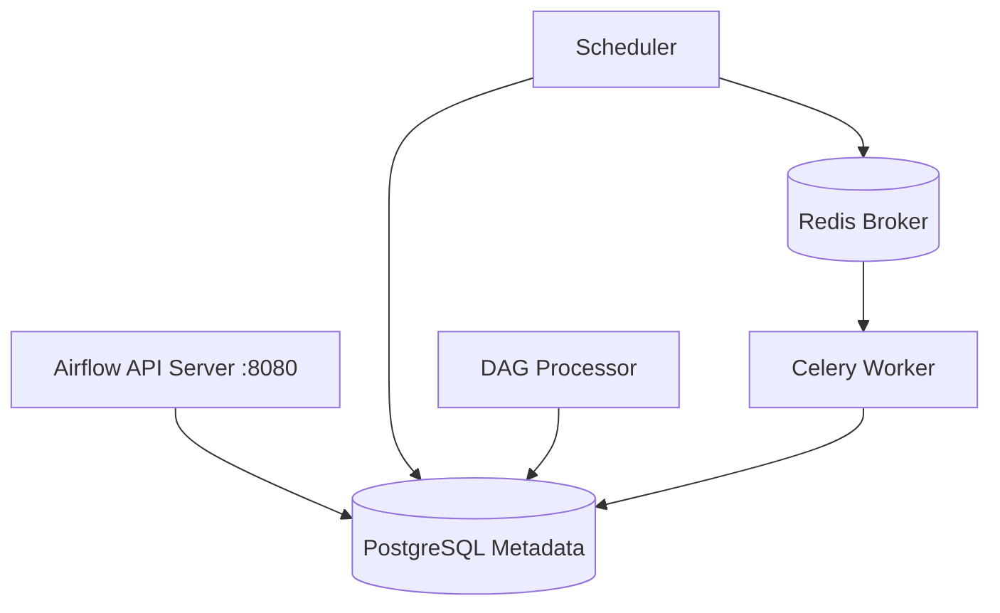

<div align="center">

# Walmart Streaming Flow

### Continuous retail events. Incremental lakehouse processing. Analytics-ready facts.

**Ghost PostgreSQL · Python · Databricks · Delta Lake · dbt · Apache Airflow · Power BI**

[](https://www.python.org/)
[](https://www.postgresql.org/)
[](https://www.databricks.com/)
[](https://www.getdbt.com/)
[](https://airflow.apache.org/)
[](https://powerbi.microsoft.com/)

**A portfolio-grade data platform that turns continuously generated, relationally valid orders into governed Gold datasets for BI.**

[Architecture](#system-architecture) · [Data flow](#data-flow-in-90-seconds) · [CDC](#incremental-cdc-design) · [dbt](#dbt-transformation-graph) · [Gold](#gold-analytics-contract) · [Runbook](./Docs/RUN_PROJECT_TOMORROW.md)

</div>

<div align="center">
  
</div>

> [!NOTE]
> This educational portfolio project is not affiliated with or endorsed by Walmart Inc. The name is used only as a retail business scenario.

---

## What this project demonstrates

This repository is more than a static ETL demo. It implements two independent clocks:

- an **operational clock**, where Order Pulse can create a coherent order every 10 seconds;
- an **analytical clock**, where Airflow runs the governed Databricks/dbt pipeline every hour or on demand.

That separation mirrors a real data platform: source systems continue to transact while analytical workloads promote changes through controlled quality gates.

| Engineering concern | Implementation |
|---|---|
| Relational correctness | Existing customers/products only; employee selected from the chosen store |
| Transaction safety | Order header and all items commit or roll back together |
| Change capture | Monotonic `change_version` assigned on every order/item insert or update |
| Incremental processing | Delta/dbt merges by stable business keys and watermarks |
| Data modeling | Bronze → Silver Technical → Silver Business → Gold |
| History | dbt timestamp snapshots for five Gold dimensions |
| Data quality | Schema, uniqueness, relationship, amount, and business-consistency tests |
| Orchestration | Airflow 3, CeleryExecutor, Redis, PostgreSQL metadata DB |
| BI semantics | Line-level `fact_orders` with documented additive and non-additive measures |
| Reproducibility | Docker Compose, locked Python dependencies, environment-driven configuration |


---

## System architecture

### Executive view

The image above is optimized for fast reading: user control, source transaction, CDC boundary, lakehouse, SQL serving, and dashboard consumption.

### Technology flow — icon-only view

<div align="center">
  
  <br>
  <sub>A text-free reading of the complete technology path; Airflow is shown below the data flow because it orchestrates the pipeline rather than transforming records itself.</sub>
</div>

> [!IMPORTANT]
> Power BI is fully integrated as the analytics consumption layer. The semantic model, dashboard pages, refresh workflow, and KPI validation complete the source-to-insight pipeline.

### Detailed engineering view

<div align="center">
  
  <br>
  <sub>Exact source entities, layer responsibilities, dbt controls, and hourly Airflow execution.</sub>
</div>

### Runtime topology



### Control plane vs. data plane

| Plane | Components | Responsibility |
|---|---|---|
| Operational data plane | Order Pulse, Python, Ghost PostgreSQL | Produce valid business transactions |
| Analytical data plane | Databricks, Delta tables, SQL Warehouse | Store, transform, and serve analytical datasets |
| Transformation plane | dbt models, snapshots, macros, tests | Encode data contracts and business semantics |
| Control plane | Airflow API server, scheduler, DAG processor, Celery worker | Schedule, sequence, retry, monitor, and fail safely |
| Consumption plane | Power BI | Validated semantic model, DAX measures, dashboards, and refresh workflow |

---

<div align="center">
  
  <br>
  <sub>Exact source entities, layer responsibilities, dbt controls, and hourly Airflow execution.</sub>
</div>

## Data flow in 90 seconds

1. A user starts **Order Pulse** from a local browser.
2. The Flask controller chooses random-customer or fixed-customer mode.
3. Python queries active reference entities from the external Ghost database.
4. One order and 1–5 items are inserted atomically into `raw.orders` and `raw.order_items`.
5. PostgreSQL triggers assign new monotonic `change_version` values.
6. Airflow triggers the remote Databricks ingestion job hourly or manually.
7. Databricks promotes source changes into Bronze.
8. dbt incrementally merges the six technical entities, builds `obt_b`, runs tests, snapshots dimensions, and publishes `fact_orders`.
9. Databricks SQL exposes the governed Gold layer to the completed Power BI semantic model.
10. A Power BI refresh reveals new orders, items, revenue, stores, employees, customers, and products.



---

## Operational source model

The source database keeps the transactional model normalized. Gold intentionally changes the grain for analytics.



### Generator invariants

For every generated order, the following statements must remain true:

```text
customer exists AND customer.is_active = 'Y'
store exists    AND store.is_active = 'Y'
employee exists AND employee.is_active = 'Y'
employee.store_id = order.store_id
1 <= number_of_order_items <= 5
product exists  AND product.is_active = 'Y' AND product.price > 0
line_amount = quantity × unit_price
order.total_amount = Σ line_amount
```

### Atomic write pattern

```python
connection.autocommit = False

try:
    customer = select_existing_customer()
    store, employee = select_valid_store_employee_pair()
    products = select_1_to_5_active_products()

    insert_order(...)
    insert_order_items(...)
    connection.commit()
except Exception:
    connection.rollback()
    raise
```

An advisory transaction lock serializes identifier allocation when multiple generator instances run concurrently. This avoids two processes selecting the same next `order_id` or `order_item_id`.

### Generator modes

| Mode            |                   Behaviour                      |                Best use                                 |
|-----------------|--------------------------------------------------|---------------------------------------------------------|
| Random customer | Selects a different valid customer when possible | Dashboard demonstrations and varied data                |
| Fixed customer  | Reuses one existing `customer_id`                | Customer journey and repeat-purchase analysis           |

The generator changes only the source database. It does **not** call Airflow, Databricks, dbt, or Power BI directly.

---

## Incremental CDC design

### Why a version cursor?

Event timestamps can collide, arrive late, or be updated without changing the original business time. The source upgrade therefore adds a dedicated, technical ordering mechanism:

```sql
CREATE SEQUENCE raw.walmart_change_version_seq AS BIGINT;

CREATE TRIGGER orders_assign_change_version
BEFORE INSERT OR UPDATE ON raw.orders
FOR EACH ROW
EXECUTE FUNCTION raw.assign_walmart_change_version();
```

Every order and item mutation receives the next sequence value. `change_version` is:

- monotonic;
- independent of business timestamps;
- non-null after backfill;
- safe for insert and update capture;
- suitable as the Lakeflow query-based connector cursor.

### Cursor strategy by entity

| Entity      |       Technical key | Incremental filter                            |
|-------------|---------------------|-----------------------------------------------|
| Orders      | `order_id`          | `change_version > max(change_version)`        |
| Order items | `order_item_id`     | `change_version > max(change_version)`        |
| Customers   | `customer_id`       | `updated_timestamp >= max(updated_timestamp)` |
| Products    | `product_id`        | `updated_timestamp >= max(updated_timestamp)` |
| Stores      | `store_id`          | `updated_timestamp >= max(updated_timestamp)` |
| Employees   | `employee_id`       | `updated_timestamp >= max(updated_timestamp)` |

The included migration utility updates only the `orders` and `order_items` connector objects and supports dry-run mode before `--apply`.

### Idempotency model

```text
same source key + same latest version
                │
                ▼
Delta/dbt MERGE matches existing row
                │
                ├── unchanged → no duplicate analytical row
                └── newer version → update the target state
```

---

## Medallion layer contracts

The dbt source is `walmart.bronze`. A custom schema macro writes explicit schemas instead of concatenating them with the profile default.

| Layer | Main objects | Materialization | Contract |
|---|---|---|---|
| Bronze | `orders`, `order_items`, `customers`, `products`, `stores`, `employees` | Managed upstream by Databricks ingestion | Source-aligned change landing |
| Silver Technical | `orders_t`, `order_items_t`, `customers_t`, `products_t`, `stores_t`, `employees_t` | Incremental `merge` | One latest technical row per primary key |
| Silver Business | `obt_b` | Table | Conformed order-line context across six entities |
| Gold preparation | `eph_*` | Ephemeral | Reusable dimension projections without extra tables |
| Gold dimensions | Five `dim_*` snapshots | Timestamp snapshots | Historical versions with dbt validity metadata |
| Gold fact | `fact_orders` | Table | One row per order item for BI measures |

### One-big-table lineage



---

## dbt transformation graph

```text
source(walmart_databricks)
│
├── orders ───────► orders_t ───────┐
├── order_items ──► order_items_t ──┤
├── customers ────► customers_t ────┤
├── products ─────► products_t ─────┼──► obt_b ──► eph_* ──► dim_* snapshots
├── stores ───────► stores_t ───────┤          └──► fact_orders
└── employees ────► employees_t ────┘
```

### Snapshot strategy

All five Gold dimensions use dbt's timestamp strategy:

```yaml
strategy: timestamp
updated_at: <entity>_updated_timestamp
dbt_valid_to_current: "to_date('9999-12-31')"
```

This creates `dbt_valid_from`, `dbt_valid_to`, `dbt_scd_id`, and current-version semantics without hand-writing SCD merge logic.

### Dimension-grain protection

`dim_orders` must remain at one business order per snapshot version. A dedicated repair macro:

1. deep-clones the current table as a recovery backup;
2. discovers its columns from `information_schema`;
3. keeps one row per `dbt_scd_id`;
4. recreates the repaired dimension.

The macro exists because joining orders to items too early can accidentally multiply an order dimension to line-item grain.

---

## Data quality gates

| Gate | Example rule | Failure prevented |
|---|---|---|
| Primary keys | `order_item_id` is unique and non-null | Duplicate fact rows |
| Positive measures | quantity, price, amount, salary > 0 | Invalid financial metrics |
| Accepted values | `is_active IN ('Y', 'N')` | Unsupported operational states |
| Relationships | item → order; item → product; order → customer/store | Orphan records |
| Business relationship | `employee.store_id = order.store_id` | Impossible employee/store pair |
| Header-line reconciliation | `MAX(order_total_amount) = SUM(sales_amount)` per order | Incorrect totals |
| Freshness | upstream source is recent before transformation | Publishing stale data |
| Final Gold test | all fact tests pass after build | Untrusted BI publication |

Custom reconciliation query:

```sql
SELECT order_id
FROM fact_orders
GROUP BY order_id
HAVING ABS(MAX(order_total_amount) - SUM(sales_amount)) > 0.01;
```

A successful test returns zero rows.

---

## Airflow orchestration

The `orchestrate` DAG runs at `@hourly`, disables historical catch-up, and serializes the analytical dependencies.

```mermaid
flowchart LR
    A[ingest_cdc] --> B[clean_target]
    B --> C[source_freshness]
    C --> D[silver_technical]
    D --> E[silver_technical_tests]
    E --> F[silver_business]
    F --> G[silver_business_tests]
    G --> H[gold_ephemeral]
    H --> I[gold_dimensions]
    I --> J[gold_facts]
    J --> K[gold_facts_tests]
```



| Task group | Command/behaviour | Failure boundary |
|---|---|---|
| CDC | Databricks SDK `jobs.run_now` + lifecycle polling | Remote job must finish with `SUCCESS` |
| Workspace cleanup | Remove generated dbt `target` and `logs` | Prevent stale artifacts |
| Silver | `dbt run/test --select silver_t|silver_b` | Block invalid entities before Gold |
| Gold dimensions | `dbt snapshot` | Preserve historical states |
| Gold fact | `dbt run/test --select path:models/gold/fact` | Final certification gate |

### Local Airflow services



---

## Gold analytics contract

### Fact grain

> `fact_orders` contains **one row per order item**, identified by `order_item_id`.

This decision is the most important Power BI contract in the project.

| Column | Semantic type | Aggregation |
|---|---|---|
| `sales_amount` / `line_amount` | Line revenue | `SUM` |
| `quantity` | Units sold | `SUM` |
| `order_id` | Degenerate order dimension | `DISTINCTCOUNT` |
| `order_total_amount` | Repeated header total | **Never SUM across fact rows** |
| `unit_price` | Unit attribute | Average or weighted calculation |
| `customer_id`, `store_id`, `employee_id`, `product_id` | Analytical keys | Relationships/grouping |
| `date_key`, `order_timestamp` | Time analysis | Date/time slicing |

### Safe DAX measures

```DAX
Revenue =
SUM ( fact_orders[sales_amount] )

Orders =
DISTINCTCOUNT ( fact_orders[order_id] )

Items Sold =
SUM ( fact_orders[quantity] )

Average Order Value =
DIVIDE ( [Revenue], [Orders] )

Average Selling Price =
DIVIDE ( [Revenue], [Items Sold] )
```

### Anti-pattern

```DAX
-- WRONG: the header amount is repeated on every item row
Revenue = SUM ( fact_orders[order_total_amount] )
```

### Recommended dashboard pages

| Page                | KPIs and visuals                                        |
|---------------------|---------------------------------------------------------|
| Executive overview  | Revenue, orders, items, AOV, hourly trend               |
| Store performance   | Revenue/orders by store, province, employee             |
| Product performance | Revenue/units by product, category, brand               |
| Customer analysis   | Frequency, value, repeat purchases, geography           |
| Operations          | Latest order time, pipeline freshness, processed rows   |

---

## Repository map

```text
Walmart Streaming Flow/
├── README.md
├── Docs/
│   ├── RUN_PROJECT_TOMORROW.md
│   └── architecture/
│       ├── walmart-streaming-flow-general-view.png
│       └── walmart-streaming-flow-end-to-end.png
├── Walmart Data Engineering/
│   ├── .env                         # local only, never committed
│   ├── deploy_raw_schema.py
│   └── Walmart dataset/
│       ├── continuous_order_generator.py
│       ├── generator_web_app.py
│       ├── ddl/
│       │   ├── walmart_schema.sql
│       │   └── 001_streaming_source_upgrade.sql
│       ├── data/                    # reference CSV data
│       ├── static/                  # Order Pulse CSS/JavaScript
│       └── templates/               # Flask HTML
└── airflow/
    ├── .env                         # local only, never committed
    ├── docker-compose.yaml
    ├── Dockerfile
    ├── dags/orchestration.py
    └── walmart_dbt/
        ├── dbt_project.yml
        ├── models/
        │   ├── sources/
        │   ├── silver_t/
        │   ├── silver_b/
        │   └── gold/
        ├── snapshots/
        ├── macros/
        ├── tests/
        └── tools/
```

---

## Quick start

For the complete startup, validation, Power BI, and shutdown procedure, use the **[project runbook](./Docs/RUN_PROJECT_TOMORROW.md)**.
For the complete page-by-page dashboard design, visual specifications, DAX measures, and validation checklist, use the **[Power BI dashboard guide](./Docs/POWER_BI_DASHBOARD_GUIDE.md)**.


### 1. Start Airflow

```powershell
cd "C:\Users\amine\OneDrive\Documents\Walmart Streaming Flow\airflow"
docker compose up -d
docker compose ps
```

Airflow UI: [http://localhost:8080](http://localhost:8080)

### 2. Start Order Pulse

```powershell
cd "C:\Users\amine\OneDrive\Documents\Walmart Streaming Flow\Walmart Data Engineering"
.\.venv\Scripts\python.exe ".\Walmart dataset\generator_web_app.py"
```

Order Pulse: [http://127.0.0.1:5050](http://127.0.0.1:5050) or the next available port printed by the application.

### 3. Generate data

Choose random mode, keep the 10-second interval, click **Start**, and wait for several orders.

### 4. Trigger the analytical pipeline

```powershell
cd "C:\Users\amine\OneDrive\Documents\Walmart Streaming Flow\airflow"
docker compose exec airflow-apiserver airflow dags trigger orchestrate
```

### 5. Validate Gold

```sql
SELECT
    MAX(order_timestamp) AS latest_order,
    COUNT(DISTINCT order_id) AS orders,
    SUM(quantity) AS items,
    SUM(sales_amount) AS revenue
FROM walmart.gold.fact_orders;
```

### 6. Refresh Power BI

Refresh the completed Power BI model only after `gold_facts_tests` succeeds.

---

## Configuration contract

No real credential belongs in Git.

| Runtime | Variable | Purpose |
|---|---|---|
| Generator | `POSTGRES_CONNECTION` | External Ghost PostgreSQL URI |
| Generator | `GHOST_API_KEY` | Ghost service credential if required by local tooling |
| Airflow | `DATABRICKS_HOST` | Workspace URL |
| Airflow | `DATABRICKS_TOKEN` | Local authentication token |
| Airflow | `DATABRICKS_HTTP_PATH` | SQL Warehouse/compute path |
| Airflow | `DATABRICKS_JOB_ID` | Remote CDC job identifier |
| Airflow | `FERNET_KEY` | Airflow encrypted-secret key |
| dbt | `DBT_CATALOG` | Target catalog, default `walmart` |
| dbt | `DBT_SCHEMA` | Profile fallback schema |
| dbt | `DBT_THREADS` | Parallel dbt threads |

> [!CAUTION]
> Rotate credentials that were ever pasted into a chat, issue, screenshot, or terminal recording. `.env` and local connection notes are explicitly ignored by Git.

---

## Verification commands

```powershell
# Docker health
docker compose -f airflow\docker-compose.yaml ps

# dbt parse inside the worker
docker exec airflow-airflow-worker-1 dbt parse `
  --project-dir /opt/airflow/walmart_dbt `
  --profiles-dir /opt/airflow/walmart_dbt

# Generator API
Invoke-RestMethod http://127.0.0.1:5050/api/status

# Airflow runs
docker compose -f airflow\docker-compose.yaml exec airflow-apiserver `
  airflow dags list-runs orchestrate
```

### Target definition of done for one complete demo cycle

- Order Pulse shows newly generated orders.
- Source rows have non-null `change_version` values.
- `ingest_cdc` finishes successfully.
- Silver Technical and Silver Business tests pass.
- Gold snapshots and `fact_orders` build successfully.
- `gold_facts_tests` passes.
- `MAX(order_timestamp)` reaches the latest generated event.
- Power BI refresh changes at least one expected KPI.

---

## Design decisions and trade-offs

| Decision | Why | Trade-off |
|---|---|---|
| Continuous generator + hourly pipeline | Realistic separation of operational and analytical workloads | Dashboard latency is bounded by the hourly run |
| PostgreSQL sequence cursor | Total ordering for order/item changes | Connector migration is required once |
| Incremental Silver merges | Avoid full reloads and duplicate keys | Watermark logic must be monitored |
| `obt_b` before Gold | Centralizes conformed joins | Wide table consumes additional storage |
| dbt snapshots | Standard, auditable SCD history | Snapshot tables grow over time |
| Line-level fact | Correct product and quantity analytics | Header totals require careful BI measures |
| Airflow controls Databricks remotely | Keeps compute outside the orchestrator | Requires job credentials and lifecycle polling |

---

## Roadmap

The complete source-to-Power BI path is implemented and validated end to end.

- [x] External Ghost PostgreSQL source
- [x] Browser-controlled continuous order generator
- [x] Atomic, FK-safe order creation
- [x] Monotonic CDC cursor for orders and items
- [x] Incremental Databricks ingestion configuration
- [x] dbt Silver Technical and Silver Business layers
- [x] Gold snapshots and line-level fact
- [x] Airflow orchestration and final quality gate
- [x] Architecture documentation and operational runbook
- [x] Databricks SQL Warehouse validation
- [x] Power BI semantic model
- [x] Executive/store/product/customer dashboard pages
- [x] Scheduled Power BI refresh
- [x] End-to-end KPI change demonstration

---

## Author

<div align="center">

### Amine Ait Ali

**Data Engineering · Lakehouse Architecture · Analytics Engineering**

PostgreSQL · Python · Databricks · Delta Lake · dbt · Apache Airflow · Power BI

Built to demonstrate how operational correctness, incremental processing, data quality, orchestration, and BI semantics fit together in one observable pipeline.

</div>
