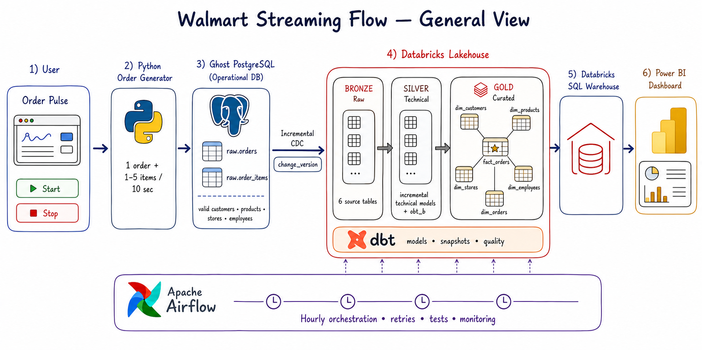

<div align="center">

# Walmart Streaming Flow

### From continuous retail orders to an analytics-ready Databricks star schema

**Ghost PostgreSQL · Python · CDC · Databricks · Delta Lake · dbt · Apache Airflow · Power BI**

[](https://www.python.org/)
[](https://www.postgresql.org/)
[](https://www.databricks.com/)
[](https://delta.io/)
[](https://www.getdbt.com/)
[](https://airflow.apache.org/)
[](https://powerbi.microsoft.com/)

A production-minded retail data engineering project that continuously creates coherent orders in an external PostgreSQL database, captures only source changes, and promotes them through Bronze, Silver, and Gold for business intelligence.

[Architecture](#architecture) · [Pipeline](#end-to-end-pipeline) · [Data model](#gold-analytics-model) · [Run locally](#run-locally) · [Roadmap](#project-status-and-roadmap)

</div>
<p><a href="./Docs/RUN_PROJECT_TOMORROW.md"><strong>Run the complete project</strong></a></p>


> [!NOTE]
> This is an educational portfolio project. It is not affiliated with or endorsed by Walmart Inc.

---

## Architecture

### Detailed end-to-end view

<div align="center">
  
  <br>
  <sub><b>Figure 1.</b> Continuous order generation, incremental CDC, Databricks Medallion processing, dbt quality gates, Airflow orchestration, and Power BI consumption.</sub>
</div>

### General platform view

<div align="center">
  
  <br>
  <sub><b>Figure 2.</b> Simplified source-to-dashboard data journey.</sub>
</div>

---

## Why this project exists

Traditional demo pipelines often load a static CSV once. Walmart Streaming Flow models a more realistic operational lifecycle:

- a browser-controlled generator creates new transactions continuously;
- every generated order respects the existing PostgreSQL business relationships;
- source rows receive a monotonic `change_version` on every insert or update;
- Databricks ingests only changes instead of performing repeated full reloads;
- dbt promotes data through incremental Silver models, a conformed business table, historical snapshots, and a Gold fact;
- Apache Airflow runs the unchanged analytical pipeline every hour;
- Power BI will consume the Gold layer through Databricks SQL.

The generator is continuous; the analytical refresh remains deliberately hourly. This separates operational event production from governed batch analytics.

---

## End-to-end pipeline

```text
Order Pulse web page
        │
        ▼
Python order generator ── atomic transaction ──► Ghost PostgreSQL / raw
                                                    │
                                                    │ change_version
                                                    ▼
                                          Databricks CDC job
                                                    │
                                                    ▼
                                      walmart.bronze (6 tables)
                                                    │
                                                    ▼
                                      dbt Silver Technical
                                                    │
                                                    ▼
                                       dbt Silver Business / obt_b
                                                    │
                                                    ▼
                                  dbt snapshots + Gold / fact_orders
                                                    │
                                                    ▼
                                  Databricks SQL Warehouse → Power BI

             Apache Airflow orchestrates the analytical path every hour
```

### Processing contract

| Stage | Technology | Responsibility | Update pattern |
|---|---|---|---|
| Operational source | Ghost PostgreSQL | Authoritative retail entities and transactions | Row-level inserts and updates |
| Event generation | Flask + Python + `psycopg2` | Create valid orders from existing business entities | One order and 1–5 items per cycle |
| Change tracking | PostgreSQL trigger + sequence | Assign a strictly increasing CDC cursor | `change_version` on insert/update |
| Bronze | Databricks + Delta Lake | Preserve source changes for downstream processing | Incremental ingestion |
| Silver Technical | dbt-databricks | Merge typed source entities by primary key | Incremental `merge` |
| Silver Business | dbt | Join the six entities into `obt_b` | Rebuilt conformed table |
| Gold | dbt snapshots + model | Preserve dimension history and publish line-level facts | SCD snapshots + fact build |
| Orchestration | Apache Airflow 3 + Celery | Schedule, sequence, retry, test, and monitor | Hourly DAG |
| Consumption | Databricks SQL + Power BI | Semantic model, KPIs, dashboards | Next project phase |

---

## Streaming source and business integrity

### Source entities

The external Ghost PostgreSQL database exposes the `raw` schema:

| Table | Role | Important relationships |
|---|---|---|
| `raw.customers` | Existing customer master | Referenced by `orders.customer_id` |
| `raw.stores` | Active store master | Referenced by orders and employees |
| `raw.employees` | Store employees | `employees.store_id → stores.store_id` |
| `raw.products` | Active product catalog and current price | Referenced by order items |
| `raw.orders` | Order header | Customer, store, employee, timestamps, status, total |
| `raw.order_items` | Order lines | Order, product, quantity, unit price, line amount |

### Generator guarantees

The generator does not invent disconnected foreign keys:

1. It selects an existing active customer.
2. It selects an active store that has at least one active employee.
3. It selects the employee from that same store.
4. It selects between one and five existing active products with a positive price.
5. It calculates each `line_amount = quantity × unit_price`.
6. It calculates the order total from its generated lines.
7. It inserts the order header and all order items in one PostgreSQL transaction.
8. It rolls back the entire transaction if any insert fails.
9. It uses a PostgreSQL advisory lock while allocating identifiers, allowing safe generator restarts.
10. Random mode varies customers, stores, employees, products, quantities, and payment methods.

The default web interval is **10 seconds** and can be changed between 2 and 3,600 seconds.

### CDC source upgrade

The additive migration in `001_streaming_source_upgrade.sql` preserves existing data while adding:

- `raw.orders.employee_id`;
- `raw.orders.change_version`;
- `raw.order_items.change_version`;
- one shared monotonic PostgreSQL sequence;
- triggers that assign a new cursor value on every insert or update;
- a foreign key from an order to the employee who handled it.

This gives the Databricks connector a reliable cursor for both newly inserted and modified rows.

---

## Databricks Medallion architecture

The analytical objects live under the Databricks catalog `walmart`.

### Bronze — source-aligned

dbt declares the six upstream Bronze tables:

```text
walmart.bronze.orders
walmart.bronze.order_items
walmart.bronze.customers
walmart.bronze.products
walmart.bronze.stores
walmart.bronze.employees
```

Bronze is the boundary between source ingestion and analytical transformation. The remote Databricks job, triggered by Airflow, is responsible for capturing source changes.

### Silver Technical — incremental entities

Each technical model is materialized incrementally and uses a business primary key with Databricks `merge`:

| Model | Unique key | Incremental cursor |
|---|---|---|
| `orders_t` | `order_id` | `change_version` |
| `order_items_t` | `order_item_id` | `change_version` |
| `customers_t` | `customer_id` | Source change version |
| `products_t` | `product_id` | Source change version |
| `stores_t` | `store_id` | Source change version |
| `employees_t` | `employee_id` | Source change version |

Every model also records `processed_at` for operational traceability.

### Silver Business — one big table

`obt_b` joins:

```text
orders_t
  ├── customers_t
  ├── order_items_t
  │     └── products_t
  ├── employees_t
  └── stores_t
```

The resulting business dataset contains the order, line, customer, product, employee, and store context needed by both Gold snapshots and facts.

### Gold — historical dimensions and facts

dbt snapshots use the timestamp strategy and an open-ended current date of `9999-12-31`:

- `dim_customers`
- `dim_products`
- `dim_stores`
- `dim_employees`
- `dim_orders`

`fact_orders` is the central analytical fact table.

---

## Gold analytics model

### Fact grain

> **One row per order item (`order_item_id`).**

This grain matters in Power BI:

- `sales_amount` and `line_amount` are additive across fact rows;
- `quantity` is additive;
- `order_total_amount` is repeated for every item in an order and **must not be summed**;
- total orders must use `DISTINCTCOUNT(order_id)`;
- average order value must be computed from one value per order.

### Fact columns

| Category | Columns |
|---|---|
| Keys | `order_id`, `order_item_id`, `product_id`, `store_id`, `employee_id`, `customer_id`, `date_key` |
| Time | `order_date`, `order_timestamp` |
| Descriptors | `payment_method`, `order_status` |
| Measures | `quantity`, `unit_price`, `sales_amount`, `line_amount`, `order_total_amount` |
| Operations | `order_is_active`, `order_item_is_active`, `processed_at` |

### Recommended Power BI measures

```DAX
Revenue =
SUM ( fact_orders[sales_amount] )

Orders =
DISTINCTCOUNT ( fact_orders[order_id] )

Items Sold =
SUM ( fact_orders[quantity] )

Average Order Value =
DIVIDE ( [Revenue], [Orders] )

Average Item Price =
DIVIDE ( [Revenue], [Items Sold] )
```

> [!IMPORTANT]
> Do not create `Total Sales = SUM(fact_orders[order_total_amount])`; the header total repeats once per order item and would overstate revenue.

### Dashboard-ready questions

- How does revenue evolve by date and hour?
- Which stores and employees process the most orders?
- Which products, categories, and brands generate the most revenue?
- Which customers have the highest order frequency and value?
- How does payment-method usage vary by store?
- What changed after the most recent hourly pipeline execution?

---

## dbt transformation and quality

The project separates technical processing, business conformance, and Gold publication.

```text
sources
  └── silver_t (incremental)
        └── silver_b / obt_b
              ├── gold/ephemeral
              ├── snapshots / dimensions
              └── gold/fact / fact_orders
```

Quality controls include:

- primary-key uniqueness and non-null checks;
- positive identifiers, quantities, prices, salaries, and sales amounts;
- accepted values for activity flags;
- relationships between orders, customers, stores, employees, items, and products;
- verification that an order employee belongs to the selected store;
- reconciliation of `MAX(order_total_amount)` with the sum of line-level `sales_amount`;
- source freshness before transformation;
- a final Gold fact test gate.

Failed critical tests stop downstream publication in Airflow.

---

## Apache Airflow orchestration

The `orchestrate` DAG runs **hourly**, disables catch-up, and limits processing to the explicit dependency chain below:

| Order | Airflow task | Action |
|---:|---|---|
| 1 | `ingest_cdc` | Trigger the remote Databricks CDC job and wait for success |
| 2 | `clean_target` | Remove generated dbt `target` and `logs` artifacts |
| 3 | `source_freshness` | Check upstream freshness |
| 4 | `silver_technical` | Run incremental Silver Technical models |
| 5 | `silver_technical_tests` | Test the technical entities |
| 6 | `silver_business` | Build the conformed `obt_b` table |
| 7 | `silver_business_tests` | Validate business relationships |
| 8 | `gold_ephemeral` | Compile reusable Gold logic |
| 9 | `gold_dimensions` | Run dbt snapshots |
| 10 | `gold_facts` | Build `fact_orders` |
| 11 | `gold_facts_tests` | Run the final Gold quality gate |

Airflow is the control plane; Databricks remains the compute plane. The DAG submits the configured Databricks job, polls its lifecycle state, and fails immediately when the remote result is unsuccessful.

### Local orchestration stack

Docker Compose runs:

- Airflow API server;
- scheduler;
- DAG processor;
- Celery worker;
- Redis broker;
- PostgreSQL metadata database.

Airflow UI: [http://localhost:8080](http://localhost:8080)

---

## Run locally

### Prerequisites

- Python 3.11–3.13
- `uv`
- Docker Desktop
- access to the external Ghost PostgreSQL database
- a Databricks workspace, job, and SQL Warehouse

### 1. Clone

```bash
git clone https://github.com/amine-LabsCraft/Walmart_streaming_Flow.git
cd Walmart_streaming_Flow
```

### 2. Configure secrets locally

Create local `.env` files from the provided examples and supply values without committing them:

```dotenv
POSTGRES_CONNECTION=postgresql://...
GHOST_API_KEY=...
DATABRICKS_HOST=https://...
DATABRICKS_TOKEN=...
DATABRICKS_HTTP_PATH=...
DATABRICKS_JOB_ID=...
```

### 3. Start Order Pulse

```powershell
cd "Walmart Data Engineering\Walmart dataset"
python -m pip install -r web_requirements.txt
python generator_web_app.py
```

Open [http://localhost:5050](http://localhost:5050), select random or fixed-customer mode, choose the interval, and press **Start**.

### 4. Start Airflow

```powershell
cd airflow
docker compose up -d --build
```

### 5. Validate dbt

```powershell
docker exec airflow-airflow-worker-1 dbt parse `
  --project-dir /opt/airflow/walmart_dbt `
  --profiles-dir /opt/airflow/walmart_dbt
```

Enable or trigger the `orchestrate` DAG from Airflow and monitor the remote Databricks run.

---

## Repository structure

```text
Walmart Streaming Flow/
├── Docs/
│   └── architecture/                   # Current README architecture images
├── Walmart Data Engineering/
│   ├── deploy_raw_schema.py
│   └── Walmart dataset/
│       ├── continuous_order_generator.py
│       ├── generator_web_app.py
│       ├── data/                       # Original reference CSV datasets
│       ├── ddl/                        # Source schema and CDC upgrade
│       ├── static/                     # Order Pulse JavaScript and CSS
│       └── templates/                  # Order Pulse HTML
├── airflow/
│   ├── dags/orchestration.py           # Hourly orchestration DAG
│   ├── docker-compose.yaml             # Local Airflow/Celery stack
│   ├── Dockerfile
│   └── walmart_dbt/
│       ├── models/
│       │   ├── sources/
│       │   ├── silver_t/
│       │   ├── silver_b/
│       │   └── gold/
│       ├── snapshots/
│       ├── macros/
│       ├── tests/
│       └── tools/
├── pyproject.toml
└── uv.lock
```

---

## Project status and roadmap

| Phase | Status |
|---|---|
| External Ghost PostgreSQL source | ✅ Ready |
| Relational dataset and CDC source upgrade | ✅ Ready |
| Browser-controlled continuous generator | ✅ Ready |
| Coherent multi-entity order generation | ✅ Ready |
| Incremental Databricks Bronze ingestion | ✅ Implemented |
| dbt Silver Technical and Business layers | ✅ Implemented |
| Gold snapshots and `fact_orders` | ✅ Implemented |
| Hourly Airflow orchestration and tests | ✅ Implemented |
| Databricks SQL Warehouse validation | 🔄 Next validation |
| Power BI semantic model and dashboards | 🔜 Next phase |

### Next phase: Databricks → Power BI

1. Validate Gold tables and permissions in Databricks.
2. Connect Power BI Desktop to the Databricks SQL Warehouse.
3. Choose Import mode for scheduled snapshots or DirectQuery for fresher exploration.
4. Build relationships from `fact_orders` to the Gold dimensions.
5. Add safe DAX measures based on the line-level fact grain.
6. Build overview, store, product, employee, and customer pages.
7. Configure refresh and verify that a new generated order changes dashboard KPIs after the hourly run.

---

## Security

- Real `.env` files, API keys, database passwords, and Databricks tokens must never be committed.
- Rotate any credential that has been pasted into a chat, issue, screenshot, or terminal recording.
- Use least-privilege identities for PostgreSQL, Databricks, and BI access.
- Prefer a Databricks service principal and secret manager for non-local environments.
- The generator should target a development or demo database, not an uncontrolled production source.

---

## Author

<div align="center">

### Amine Ait Ali

Data Engineering · Lakehouse Architecture · Analytics Engineering

**PostgreSQL · Python · Databricks · Delta Lake · dbt · Apache Airflow · Power BI**

⭐ If this project helps you, consider starring the repository.

</div>
